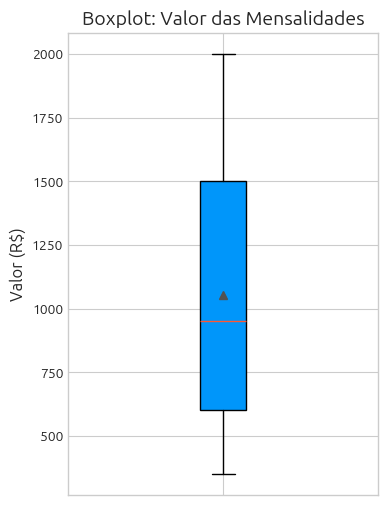
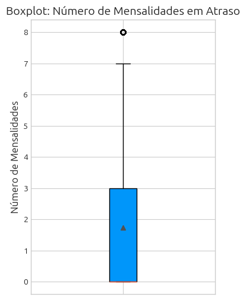
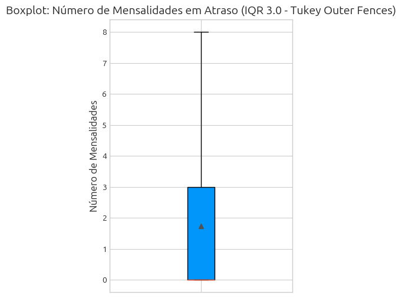
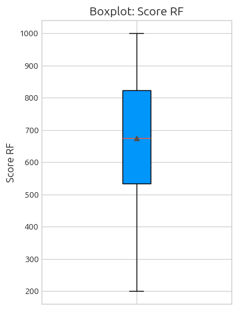
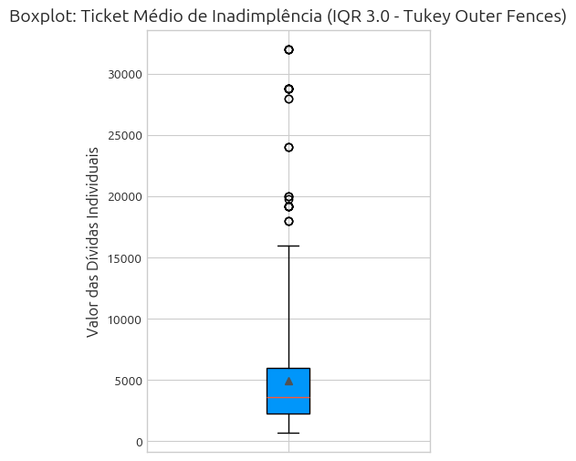

# Análise de inadimplência e performance de recuperação (Case Isaac).

## 1. Business Understanding

### 1.1. Contexto

#### 1.1.1. Contexto Fornecido

O isaac é uma fintech educacional e atua no ecossistema da Arco Educação. Seu principal produto é a Garantia de Mensalidades: a empresa compra os recebíveis das escolas parceiras, garante repasses financeiros em datas pré-definidas e assumi o risco de inadimplência. Os responsáveis financeiros (RFs) pagam as mensalidades diretamente para o isaac. 

A inadimplência afeta o fluxo de caixa, com consequências ao planejamento e novos investimentos, assim consome esforços administrativos e desvia o negócio escolar de sua fonte de especialidade: gestão pedagógica.

A empresa atua de acordo com a regulamentação do setor (Lei 9.870/99), que não permite a interrupção de estudos durante o ciclo letivo anual, porém os RF's são impedidos de rematrícula enquanto não houver regularização. Isaac apoia no planejamento financeiro, possibilita controle de fluxo de caixa e fornece produtos adicionais como o Seguro Familiar, em conjunto com a Porto, para garantir a tranquilidade financeira em caso de imprevistos (óbito, incapacidade temporária ou perda de vínculo CLT).

A área de Collections é responsável por aumentar a recuperação de valores em atraso com o menor custo possível, por exemplo, utilizando-se de análise de dados e gerenciamento da comunicação.

#### 1.1.2. Contexto Complementar

A parceria escolar com isaac já promoveu em média:
- aumento de 9% na base de alunos matriculados
- crescimento de 10% de receita
- mais de 50% de matrículas antecipadas
- redução de mais de 30% de famílias com pendências na rematrícula

A área de Collections está inserida dentro da estrutura organizacional de Customer Sucess. O objetivo é facilmente inferível: customer centricity, unificar o processo de cobrança ao sucesso do cliente e experiência do cliente final. Isso se relaciona com um dos valores da Arco. 

Regras de negócio devem andar junto dos números e o cerne da evolução do Isaac é efeciência de cobrança. Porém, um dos maiores ruídos da sociedade atual é a comunicação (mais específicamente o excesso). Neste case não teremos análises de correlação com eNPS, mas fica o ponto de atenção sobre eficiência não ser somente custos na recuperação de um ativo, e sim uma análise conjunta dos impactos na construção de relacionamentos de longo prazo, em um mercado onde relacões de RF's com uma instituição podem durar mais de uma década.

Estratégias de redução da inadimplência passam por evitar abordagens constrangedoras durante a cobrança e automatizar uma régua de cobrança personalizada, com lembretes e notificações de atraso (focada em resolutividade e tom de voz adequado). A flexibilidade na negociação também é relevante. E o mais importante, uma inteligência operacional através de dados para identificar comportamentos de pagamento e agir com antecipação à inadimplência (por exemplo, através da análise de crédito em matrículas).

A TakTile, uma plataforma de decision engine, permite que a equipe do isaac crie, teste e implemente políticas de cobrança efetivas. O resultado mais importante desta parceria foi a redução de 11% da inadimplencia. A implementação de **políticas personalizadas por segmentações** e a **escalabilidade de iterações** foram pontos fundamentais para o resultado alcançado. Possíveis pontos de atenção: excessiva quebra de nós no modelo de decisão e falta de documentação (ambas levando a falta de interpretabilidade). IA fornece amplos poderes de escalar processamento, porém o seu tripé também é composto por Dados e Conhecimento Documentado. A **Governança** costuma ser peça-chave neste quebra-cabeça de gerir os dois pontos anteriores.

### 1.2. Objetivos

- Bloco 1: Definir ao menos 3 indicadores para inadimplência e risco da carteira, explicitando escolhas e aplicação;
- Bloco 2: Segmentação de RFs, com critérios expostos, seguidos de análise de dados e insight de atuação;
- Bloco 3: Avaliar o resultado e a rentabilidade do teste de cobrança.


### 1.3. Data Description

#### 1.3.1 Dictionary

O arquivo xlsx contém duas abas com dados a serem trabalhados:

> aba `bd_blocos_1_e_2`: reflete a situação da carteira ao final de agosto, o oitavo mês de um ciclo letivo de 12 meses.

| *Atributo*                   | *Descrição*                                                                                      |
| :------------------------ | :----------------------------------------------------------------------------------------------- |
| `Aluno`                   | Identificador do aluno (ex.: Aluno 0001)                                                         |
| `Responsavel_Financeiro`  | Identificador do RF pagador (ex.: RF0001). Um mesmo RF pode ter mais de um aluno matriculado     |
| `Escola`                  | Escola vinculada (ex: Escola01)                                                                  |
| `Valor_Mensalidade`       | Valor da mensalidade da escola (R$)                                                              |
| `Mensalidades_Totais`     | Total de mensalidades no contrato anual                                                          |
| `Mensalidades_Vencidas`   | Mensalidades com data de vencimento já passada                                                   |
| `Mensalidades_em_Atraso`  | Mensalidades vencidas e não pagas                                                                |
| `Dias_de_Atraso`          | Dias em atraso                                                                                   |
| `Score_RF`                | Pontuação de risco do RF, de 0 a 1000. Quanto maior, maior a probabilidade de pagamento          |
| `Status_Matricula_RF`     | Situação do RF em relação ao ano anterior: Rematriculado s/ Pendências de anos anteriores, Rematriculado c/ Pendências de anos anteriores ou Matrícula Nova. Consistente para um RF   |

> aba `bd_bloco_3`: dados referentes ao teste executado em setembro, referente à recuperação do valor atrasado em agosto.

| *Atributo*                       | *Descrição*                                                                                      |
| :------------------------------- | :----------------------------------------------------------------------------------------------- |
| `RF`                             | Identificador do RF pagador (ex.: RF0001). Um mesmo RF pode ter mais de um aluno matriculado     |
| `Mensalidades_em_Atraso_inicio`  | Mensalidades em atraso no início do teste (agosto)                                               |
| `Mensalidades_Pagas`             | Mensalidades pagas durante o mês de agosto                                                       |
| `Grupo`                          | Grupo do RF no teste (Controle, Teste A ou Teste B)                                              |


#### 1.3.2. Informações Complementares

O Isaac conduziu um teste de alavancas de cobrança durante o mês de agosto com todos os RFs que tinham 60 ou mais dias de atraso ao início do mês. Os RFs foram divididos aleatoriamente em três grupos:

| *Grupo*       | *Descrição*                                                                           |
| :---------- | :---------------------------------------------------------------------------------- |
| `Controle`  | Mensageria padrão: WhatsApp e e-mail nas frequências normais                        |
| `Teste A`   | Mensageria padrão + envio de Carta Extrajudicial (notificação formal de débito)     |
| `Teste B`   | Mensageria padrão com frequência dobrada de envios                                  |

Foram disponibilizamos as informações de custo:

| *Item*                 | *Custo unitário*                     |
| :--------------------- | :----------------------------------- |
| `Carta Extrajudicial`  | R$ 23,00 por carta                   |
| `Mensagem WhatsApp`    | R$ 0,25 por mensagem                 |
| `E-mail de cobrança`   | R$ 0,10 por e-mail                   |

 Segue abaixo o padrão utilizado de disparos por canal de comunicação:

| *Canal*       | *Frequência padrão*                                |  *Frequência dobrada*   |
| :------------ | :------------------------------------------------- | :---------------------- |
| `WhatsApp`    | 1 mensagem a cada 5 dias (~6/mês)                  | ~12/mês                 |
| `E-mail`      | 1 mensagem a cada 10 dias (~3/mês)                 | ~6/mês                  |

## 2. Data Understanding

### 2.1. Setup


```python
import pandas as pd
import numpy as np
import matplotlib.pyplot as plt
import seaborn as sns
from scipy.stats import chisquare
from scipy import stats

print('Bibliotecas importadas com sucesso.')
```

    Bibliotecas importadas com sucesso.


### 2.2. Read


```python
try:
    df_customers = pd.read_excel('../Dataset/Case Collections - Dados.xlsx', sheet_name='bd_blocos_1_e_2')
    print('DataFrame df_customers carregado com sucesso.')
except Exception as e:
    print(f'Erro ao carregar df_customers: {e}')

try:
    df_collection_test = pd.read_excel('../Dataset/Case Collections - Dados.xlsx', sheet_name='bd_bloco_3')
    print('DataFrame df_collection_test carregado com sucesso.')
except Exception as e:
    print(f'Erro ao carregar df_collection_test: {e}')
```

    DataFrame df_customers carregado com sucesso.


    DataFrame df_collection_test carregado com sucesso.


### 2.3. Customer

#### 2.3.1. Integridade


```python
print(f'Tamanho do dataframe: {df_customers.shape}\n')
df_customers.head(5)
```

    Tamanho do dataframe: (5000, 10)
    


<div>
<style scoped>
    .dataframe tbody tr th:only-of-type {
        vertical-align: middle;
    }

    .dataframe tbody tr th {
        vertical-align: top;
    }

    .dataframe thead th {
        text-align: right;
    }
</style>
<table border="1" class="dataframe">
  <thead>
    <tr style="text-align: right;">
      <th></th>
      <th>Aluno</th>
      <th>Responsavel_Financeiro</th>
      <th>Escola</th>
      <th>Valor_Mensalidade</th>
      <th>Mensalidades_Totais</th>
      <th>Mensalidades_Vencidas</th>
      <th>Mensalidades_em_Atraso</th>
      <th>Dias_de_Atraso</th>
      <th>Score_RF</th>
      <th>Status_Matricula_RF</th>
    </tr>
  </thead>
  <tbody>
    <tr>
      <th>0</th>
      <td>Aluno 0001</td>
      <td>RF0001</td>
      <td>Escola03</td>
      <td>350</td>
      <td>12</td>
      <td>8</td>
      <td>3</td>
      <td>90</td>
      <td>602</td>
      <td>Matrícula Nova</td>
    </tr>
    <tr>
      <th>1</th>
      <td>Aluno 0002</td>
      <td>RF0002</td>
      <td>Escola03</td>
      <td>350</td>
      <td>12</td>
      <td>8</td>
      <td>0</td>
      <td>0</td>
      <td>674</td>
      <td>Rematriculado s/ Pendências</td>
    </tr>
    <tr>
      <th>2</th>
      <td>Aluno 0003</td>
      <td>RF0003</td>
      <td>Escola03</td>
      <td>350</td>
      <td>12</td>
      <td>8</td>
      <td>2</td>
      <td>60</td>
      <td>617</td>
      <td>Matrícula Nova</td>
    </tr>
    <tr>
      <th>3</th>
      <td>Aluno 0004</td>
      <td>RF0004</td>
      <td>Escola03</td>
      <td>350</td>
      <td>12</td>
      <td>8</td>
      <td>0</td>
      <td>0</td>
      <td>712</td>
      <td>Rematriculado s/ Pendências</td>
    </tr>
    <tr>
      <th>4</th>
      <td>Aluno 0005</td>
      <td>RF0005</td>
      <td>Escola03</td>
      <td>350</td>
      <td>12</td>
      <td>8</td>
      <td>0</td>
      <td>0</td>
      <td>735</td>
      <td>Rematriculado s/ Pendências</td>
    </tr>
  </tbody>
</table>
</div>


```python
df_customers.info()
```

    <class 'pandas.DataFrame'>
    RangeIndex: 5000 entries, 0 to 4999
    Data columns (total 10 columns):
     #   Column                  Non-Null Count  Dtype
    ---  ------                  --------------  -----
     0   Aluno                   5000 non-null   str  
     1   Responsavel_Financeiro  5000 non-null   str  
     2   Escola                  5000 non-null   str  
     3   Valor_Mensalidade       5000 non-null   int64
     4   Mensalidades_Totais     5000 non-null   int64
     5   Mensalidades_Vencidas   5000 non-null   int64
     6   Mensalidades_em_Atraso  5000 non-null   int64
     7   Dias_de_Atraso          5000 non-null   int64
     8   Score_RF                5000 non-null   int64
     9   Status_Matricula_RF     5000 non-null   str  
    dtypes: int64(6), str(4)
    memory usage: 390.8 KB


Não existem linhas nulas ou atributos com dados nulos. Não será necessário transformação nos tipos dos dados, pois já estão em suas formas necessárias.


```python
print(f'Número de alunos únicos: {df_customers["Aluno"].nunique()}')
print(f'Número de registros: {df_customers.shape[0]}')
```

    Número de alunos únicos: 5000
    Número de registros: 5000


A base de dados não possui duplicatas quanto a identificação de aluno. A base está correta em seu objetivo de cada registro (linha) ser único.


```python
print(f'Número de RFs únicos: {df_customers["Responsavel_Financeiro"].nunique()}')
```

    Número de RFs únicos: 4000


```python
df_customers.groupby('Responsavel_Financeiro')['Aluno'].nunique().sort_values(ascending=False).value_counts()
```


    Aluno
    1    3014
    2     975
    3       8
    4       3
    Name: count, dtype: int64


A base de dados possui número menor de RFs do que alunos, o que significa alunos diferentes representados por um mesmo RF. Mais de três quartos possuem somente um aluno.


```python
print(f'Número de escolas únicas: {df_customers["Escola"].nunique()}')
```

    Número de escolas únicas: 10


```python
df_customers['Escola'].value_counts()
```


    Escola
    Escola03    500
    Escola07    500
    Escola09    500
    Escola10    500
    Escola01    500
    Escola02    500
    Escola04    500
    Escola05    500
    Escola06    500
    Escola08    500
    Name: count, dtype: int64


```python
df_customers.groupby('Escola')['Valor_Mensalidade'].agg(['count', 'min', 'max'])
```


<div>
<style scoped>
    .dataframe tbody tr th:only-of-type {
        vertical-align: middle;
    }

    .dataframe tbody tr th {
        vertical-align: top;
    }

    .dataframe thead th {
        text-align: right;
    }
</style>
<table border="1" class="dataframe">
  <thead>
    <tr style="text-align: right;">
      <th></th>
      <th>count</th>
      <th>min</th>
      <th>max</th>
    </tr>
    <tr>
      <th>Escola</th>
      <th></th>
      <th></th>
      <th></th>
    </tr>
  </thead>
  <tbody>
    <tr>
      <th>Escola01</th>
      <td>500</td>
      <td>900</td>
      <td>900</td>
    </tr>
    <tr>
      <th>Escola02</th>
      <td>500</td>
      <td>1000</td>
      <td>1000</td>
    </tr>
    <tr>
      <th>Escola03</th>
      <td>500</td>
      <td>350</td>
      <td>350</td>
    </tr>
    <tr>
      <th>Escola04</th>
      <td>500</td>
      <td>1200</td>
      <td>1200</td>
    </tr>
    <tr>
      <th>Escola05</th>
      <td>500</td>
      <td>1500</td>
      <td>1500</td>
    </tr>
    <tr>
      <th>Escola06</th>
      <td>500</td>
      <td>1800</td>
      <td>1800</td>
    </tr>
    <tr>
      <th>Escola07</th>
      <td>500</td>
      <td>450</td>
      <td>450</td>
    </tr>
    <tr>
      <th>Escola08</th>
      <td>500</td>
      <td>2000</td>
      <td>2000</td>
    </tr>
    <tr>
      <th>Escola09</th>
      <td>500</td>
      <td>600</td>
      <td>600</td>
    </tr>
    <tr>
      <th>Escola10</th>
      <td>500</td>
      <td>750</td>
      <td>750</td>
    </tr>
  </tbody>
</table>
</div>


Possuímos uma amostragem igual de alunos entre as 10 escolas. A base foi simplificada para a simulação de case: as mensalidades dentro de uma mesma escola não apresenta descontos, bolsas e variações entre as séries dos alunos.


```python
df_customers['Status_Matricula_RF'].unique()
```


    <StringArray>
    ['Matrícula Nova', 'Rematriculado s/ Pendências',
     'Rematriculado c/ Pendências']
    Length: 3, dtype: str


```python
df_customers.describe()
```


<div>
<style scoped>
    .dataframe tbody tr th:only-of-type {
        vertical-align: middle;
    }

    .dataframe tbody tr th {
        vertical-align: top;
    }

    .dataframe thead th {
        text-align: right;
    }
</style>
<table border="1" class="dataframe">
  <thead>
    <tr style="text-align: right;">
      <th></th>
      <th>Valor_Mensalidade</th>
      <th>Mensalidades_Totais</th>
      <th>Mensalidades_Vencidas</th>
      <th>Mensalidades_em_Atraso</th>
      <th>Dias_de_Atraso</th>
      <th>Score_RF</th>
    </tr>
  </thead>
  <tbody>
    <tr>
      <th>count</th>
      <td>5000.000000</td>
      <td>5000.0</td>
      <td>5000.0</td>
      <td>5000.000000</td>
      <td>5000.00000</td>
      <td>5000.000000</td>
    </tr>
    <tr>
      <th>mean</th>
      <td>1055.000000</td>
      <td>12.0</td>
      <td>8.0</td>
      <td>1.732400</td>
      <td>51.97200</td>
      <td>674.076400</td>
    </tr>
    <tr>
      <th>std</th>
      <td>534.585967</td>
      <td>0.0</td>
      <td>0.0</td>
      <td>2.461057</td>
      <td>73.83171</td>
      <td>185.014731</td>
    </tr>
    <tr>
      <th>min</th>
      <td>350.000000</td>
      <td>12.0</td>
      <td>8.0</td>
      <td>0.000000</td>
      <td>0.00000</td>
      <td>200.000000</td>
    </tr>
    <tr>
      <th>25%</th>
      <td>600.000000</td>
      <td>12.0</td>
      <td>8.0</td>
      <td>0.000000</td>
      <td>0.00000</td>
      <td>534.000000</td>
    </tr>
    <tr>
      <th>50%</th>
      <td>950.000000</td>
      <td>12.0</td>
      <td>8.0</td>
      <td>0.000000</td>
      <td>0.00000</td>
      <td>674.000000</td>
    </tr>
    <tr>
      <th>75%</th>
      <td>1500.000000</td>
      <td>12.0</td>
      <td>8.0</td>
      <td>3.000000</td>
      <td>90.00000</td>
      <td>822.000000</td>
    </tr>
    <tr>
      <th>max</th>
      <td>2000.000000</td>
      <td>12.0</td>
      <td>8.0</td>
      <td>8.000000</td>
      <td>240.00000</td>
      <td>1000.000000</td>
    </tr>
  </tbody>
</table>
</div>


```python
df_customers.groupby('Mensalidades_em_Atraso')['Dias_de_Atraso'].agg(['count', 'min', 'max'])
```


<div>
<style scoped>
    .dataframe tbody tr th:only-of-type {
        vertical-align: middle;
    }

    .dataframe tbody tr th {
        vertical-align: top;
    }

    .dataframe thead th {
        text-align: right;
    }
</style>
<table border="1" class="dataframe">
  <thead>
    <tr style="text-align: right;">
      <th></th>
      <th>count</th>
      <th>min</th>
      <th>max</th>
    </tr>
    <tr>
      <th>Mensalidades_em_Atraso</th>
      <th></th>
      <th></th>
      <th></th>
    </tr>
  </thead>
  <tbody>
    <tr>
      <th>0</th>
      <td>2607</td>
      <td>0</td>
      <td>0</td>
    </tr>
    <tr>
      <th>1</th>
      <td>568</td>
      <td>30</td>
      <td>30</td>
    </tr>
    <tr>
      <th>2</th>
      <td>466</td>
      <td>60</td>
      <td>60</td>
    </tr>
    <tr>
      <th>3</th>
      <td>348</td>
      <td>90</td>
      <td>90</td>
    </tr>
    <tr>
      <th>4</th>
      <td>248</td>
      <td>120</td>
      <td>120</td>
    </tr>
    <tr>
      <th>5</th>
      <td>226</td>
      <td>150</td>
      <td>150</td>
    </tr>
    <tr>
      <th>6</th>
      <td>117</td>
      <td>180</td>
      <td>180</td>
    </tr>
    <tr>
      <th>7</th>
      <td>66</td>
      <td>210</td>
      <td>210</td>
    </tr>
    <tr>
      <th>8</th>
      <td>354</td>
      <td>240</td>
      <td>240</td>
    </tr>
  </tbody>
</table>
</div>


- Existe confiança nos atributos Mensalidades Totais e Mensalidades Vencidas, pois era esperado uma única resposta a todos os registros (a exceção seria trabalhar com ingressantes em meio ao período letivo);
- O menor score é 200 e o maior é 1000, portanto temos uma escala de 0-1000;
- Mensalidades em Atraso estão ok, não existem ocorrências para além do possível;
- Dias em atraso não se trata de uma coluna numérica discreta, mas sim uma categórica ordinal;

Os dados trazem um cenário onde a premissa a ser assumida é de que: uma vez que uma parcela não foi paga (mês 2, por exemplo) e não foi sanada após 30 dias, as seguintes também não serão pagas. Isso pode ser assumido porque quando agrupamos por número de mensalidades em atraso, não existe variância na quantidade de dias de atraso.


```python
df_customers.groupby('Responsavel_Financeiro')['Escola'].nunique().sort_values(ascending=False)
```


    Responsavel_Financeiro
    RF0001    1
    RF0002    1
    RF0003    1
    RF0004    1
    RF0005    1
             ..
    RF3996    1
    RF3997    1
    RF3998    1
    RF3999    1
    RF4000    1
    Name: Escola, Length: 4000, dtype: int64


Os RFs desta base, quando possuem mais de um aluno sob sua tutela, possuem compromisso com somente 1 escola.


```python
df_customers.groupby('Responsavel_Financeiro')['Score_RF'].nunique().sort_values(ascending=False)
```


    Responsavel_Financeiro
    RF0001    1
    RF0002    1
    RF0003    1
    RF0004    1
    RF0005    1
             ..
    RF3996    1
    RF3997    1
    RF3998    1
    RF3999    1
    RF4000    1
    Name: Score_RF, Length: 4000, dtype: int64


Os RFs desta base, quando possuem mais de um aluno sob sua tutela, possuem seu Score parametrizado para somente 1 valor (fator esperado e desejado).


```python
df_customers.groupby('Responsavel_Financeiro')['Status_Matricula_RF'].nunique().sort_values(ascending=False)
```


    Responsavel_Financeiro
    RF0001    1
    RF0002    1
    RF0003    1
    RF0004    1
    RF0005    1
             ..
    RF3996    1
    RF3997    1
    RF3998    1
    RF3999    1
    RF4000    1
    Name: Status_Matricula_RF, Length: 4000, dtype: int64


Os RFs desta base, quando possuem mais de um aluno sob sua tutela, possuem o status de matrícula para somente 1 valor (fator esperado e desejado).

>Não existe preocupação quanto à integridade dados fornecidos. Faremos uma primeira leitura do cenário que eles apresentam.

#### 2.3.2. Exploratório


```python
plt.style.use('seaborn-v0_8-whitegrid')
custom_colors = ['#0096FA', '#FF5733', '#525252']

plt.rcParams.update({
    'figure.figsize': (8, 5),
    'axes.titlesize': 14,
    'axes.labelsize': 12,
    'xtick.labelsize': 10,
    'ytick.labelsize': 10,
    'legend.fontsize': 10,
    'lines.linewidth': 2,
    'font.family': 'Ubuntu',
    'axes.prop_cycle': plt.cycler(color=custom_colors)
})
```

Para cada variável numérica que existam outliers será calculado skewness para verificar a simetria da distribuição, como indício de normalidade. Para cada possibilidade:

| Skewness | Forma | Estratégia |
| :------- | :---- | :--------- |
| -0.5 < x < 0.5 | Simétrica ou Aproximadamente simétrica | Boxplot padrão (IQR 1.5×) |
| -1.0 < x < -0.5 ou 0.5 < x < 1.0 | Moderadamente assimétrica | Boxplot - Tukey Fences (IQR 3.0×) |
| -1.0 > x ou x > 1.0 | Fortemente assimétrica | Boxplot - Tukey Fences (IQR 3.0×) |


Não identificaremos outliers as cegas e sim de acordo com as propriedades. O modelo de Tukey visa não apagar sinais de distribuição assimétricas que são comportamentos legítimos. De toda forma, neste case não iremos trabalhar com a exclusão de outliers.


```python
print(f'Skewness do valor das mensalidades: {df_customers["Valor_Mensalidade"].skew():.2f}')
```

    Skewness do valor das mensalidades: 0.43


```python
plt.figure(figsize=(4, 6))
plt.boxplot(df_customers['Valor_Mensalidade'], patch_artist=True, showmeans=True)
plt.title('Boxplot: Valor das Mensalidades')
plt.ylabel('Valor (R$)')
xticks = plt.xticks([1], [''])
plt.show()
```


    

    


A média e a mediana se aproximam de mensalidades de R$1.000,00. Temos uma leve simetria, no limite de assimetria a direita devido a uma pequena concentração de valores mais baixos. A existência de algumas escolas com tickets mais altos, chegando a R$2.000,00, puxa a média para cima. O risco financeiro, portanto, não está distribuído igualmente, por exemplo, a inadimplência de uma mensalidade de uma escola de R$2.000,00 se equivale a inadimplência de quase 6 alunos de R$350,00 ou o dobro do risco do valor mediano.


```python
print(f'Skewness do número de mensalidades em atraso: {df_customers["Mensalidades_em_Atraso"].skew():.2f}')
```

    Skewness do número de mensalidades em atraso: 1.39


```python
plt.figure(figsize=(4, 6))
plt.boxplot(df_customers['Mensalidades_em_Atraso'], patch_artist=True, showmeans=True)
plt.title('Boxplot: Número de Mensalidades em Atraso')
plt.ylabel('Número de Mensalidades')
xticks = plt.xticks([1], [''])
plt.show()
```


    

    


```python
plt.figure(figsize=(4, 6))
plt.boxplot(df_customers['Mensalidades_em_Atraso'], patch_artist=True, showmeans=True, whis=3.0)
plt.title('Boxplot: Número de Mensalidades em Atraso (IQR 3.0 - Tukey Outer Fences)')
plt.ylabel('Número de Mensalidades')
xticks = plt.xticks([1], [''])
plt.show()
```


    

    


A aplicação de Tukey se mostra importante aqui: o atraso de 8 mensalidades, por mais que sejam casos extremos e indesejados, se mostra uma situação inerente ao contexto de negócio ao invés de ruído estatístico. Possuimos uma forte assimetria a direita. A mediana é zero e indica o limite de Q2, o que corresponde ao comentário de que ao menos metade da base está em dia. A média é de quase 2 mensalidades atrasadas, valor que ocorre devido a existência de alguns casos com atrasos acima de Q3 (3 atrasos), chegando a 8 mensalidades. Aqui já existe um possível questionamento da saúde desta carteira (vamos calcular isto posteriormente). Pela distribuição de quartis temos que 25% da base de alunos possui de 3 a 8 parcelas atrasadas e indica necessidade intensa de recuperação.


```python
print(f'Skewness do número de scores RF : {df_customers["Score_RF"].skew():.2f}')
```

    Skewness do número de scores RF : -0.09


```python
plt.figure(figsize=(4, 6))
plt.boxplot(df_customers['Score_RF'], patch_artist=True, showmeans=True)
plt.title('Boxplot: Score RF')
plt.ylabel('Score RF')
xticks = plt.xticks([1], [''])
plt.show()
```


    

    


```python
q1_iqr_customer = df_customers['Score_RF'].quantile(0.25)
q3_iqr_customer = df_customers['Score_RF'].quantile(0.75)
print(q1_iqr_customer, q3_iqr_customer)
```

    534.0 822.0


A distribuição de Score RF é simétrica. Média e mediana estão pouco abaixo de 700. O IQR está localizado a partir de 534, o que significa que 75% dos alunos possuem RF's com valores de score cuja faixa já é identificada como boa. A indicação inicial que temos é de um início de ano letivo com uma base de clientes saudáveis para crédito.


```python
freq_status = df_customers['Status_Matricula_RF'].value_counts().reset_index(name='absoluta')
freq_status['relativa'] = (freq_status['absoluta'] / freq_status['absoluta'].sum()*100)
freq_status['cumulativa'] = freq_status['relativa'].cumsum()
freq_status
```


<div>
<style scoped>
    .dataframe tbody tr th:only-of-type {
        vertical-align: middle;
    }

    .dataframe tbody tr th {
        vertical-align: top;
    }

    .dataframe thead th {
        text-align: right;
    }
</style>
<table border="1" class="dataframe">
  <thead>
    <tr style="text-align: right;">
      <th></th>
      <th>Status_Matricula_RF</th>
      <th>absoluta</th>
      <th>relativa</th>
      <th>cumulativa</th>
    </tr>
  </thead>
  <tbody>
    <tr>
      <th>0</th>
      <td>Rematriculado s/ Pendências</td>
      <td>2034</td>
      <td>40.68</td>
      <td>40.68</td>
    </tr>
    <tr>
      <th>1</th>
      <td>Matrícula Nova</td>
      <td>1657</td>
      <td>33.14</td>
      <td>73.82</td>
    </tr>
    <tr>
      <th>2</th>
      <td>Rematriculado c/ Pendências</td>
      <td>1309</td>
      <td>26.18</td>
      <td>100.00</td>
    </tr>
  </tbody>
</table>
</div>


Ao olhar a tabela de frequência vemos que a maior parte da base de alunos teve sua matrícula sem alarmes prévio de futuros problemas (`Rematriculado s/ Pendências` e `Matrícula Nova`). Porém, mais do que 25% representavam renovações com RFs que já continham problemas financeiros sem resolução em seu histórico. Essa análise será refeita mais a frente pelo viés de RFs, mas aqui já existe um indicativo de cuidado.

### 2.4. Collection

#### 2.4.1. Integridade


```python
print(f'Tamanho do dataframe: {df_collection_test.shape}\n')
df_collection_test.head(5)
```

    Tamanho do dataframe: (1459, 4)
    


<div>
<style scoped>
    .dataframe tbody tr th:only-of-type {
        vertical-align: middle;
    }

    .dataframe tbody tr th {
        vertical-align: top;
    }

    .dataframe thead th {
        text-align: right;
    }
</style>
<table border="1" class="dataframe">
  <thead>
    <tr style="text-align: right;">
      <th></th>
      <th>RF</th>
      <th>Mensalidades_em_Atraso_inicio</th>
      <th>Mensalidades_Pagas</th>
      <th>Grupo</th>
    </tr>
  </thead>
  <tbody>
    <tr>
      <th>0</th>
      <td>RF0001</td>
      <td>3</td>
      <td>0</td>
      <td>Controle</td>
    </tr>
    <tr>
      <th>1</th>
      <td>RF0003</td>
      <td>2</td>
      <td>0</td>
      <td>Controle</td>
    </tr>
    <tr>
      <th>2</th>
      <td>RF0008</td>
      <td>4</td>
      <td>0</td>
      <td>Teste B</td>
    </tr>
    <tr>
      <th>3</th>
      <td>RF0012</td>
      <td>8</td>
      <td>0</td>
      <td>Teste A</td>
    </tr>
    <tr>
      <th>4</th>
      <td>RF0014</td>
      <td>2</td>
      <td>0</td>
      <td>Teste A</td>
    </tr>
  </tbody>
</table>
</div>


```python
df_collection_test.info()
```

    <class 'pandas.DataFrame'>
    RangeIndex: 1459 entries, 0 to 1458
    Data columns (total 4 columns):
     #   Column                         Non-Null Count  Dtype
    ---  ------                         --------------  -----
     0   RF                             1459 non-null   str  
     1   Mensalidades_em_Atraso_inicio  1459 non-null   int64
     2   Mensalidades_Pagas             1459 non-null   int64
     3   Grupo                          1459 non-null   str  
    dtypes: int64(2), str(2)
    memory usage: 45.7 KB


O dataframe de Teste de Cobrança não possui valores nulos.


```python
print(f'Número de RFs únicos: {df_collection_test["RF"].nunique()}')
```

    Número de RFs únicos: 1459


```python
df_customers[(df_customers['Mensalidades_em_Atraso'] > 0) & (df_customers['Dias_de_Atraso'] >= 60)
             ].groupby('Responsavel_Financeiro')['Mensalidades_em_Atraso'].sum().reset_index(name='Total_Mensalidades_Atrasadas')
```


<div>
<style scoped>
    .dataframe tbody tr th:only-of-type {
        vertical-align: middle;
    }

    .dataframe tbody tr th {
        vertical-align: top;
    }

    .dataframe thead th {
        text-align: right;
    }
</style>
<table border="1" class="dataframe">
  <thead>
    <tr style="text-align: right;">
      <th></th>
      <th>Responsavel_Financeiro</th>
      <th>Total_Mensalidades_Atrasadas</th>
    </tr>
  </thead>
  <tbody>
    <tr>
      <th>0</th>
      <td>RF0001</td>
      <td>3</td>
    </tr>
    <tr>
      <th>1</th>
      <td>RF0003</td>
      <td>2</td>
    </tr>
    <tr>
      <th>2</th>
      <td>RF0008</td>
      <td>4</td>
    </tr>
    <tr>
      <th>3</th>
      <td>RF0012</td>
      <td>8</td>
    </tr>
    <tr>
      <th>4</th>
      <td>RF0014</td>
      <td>2</td>
    </tr>
    <tr>
      <th>...</th>
      <td>...</td>
      <td>...</td>
    </tr>
    <tr>
      <th>1454</th>
      <td>RF3973</td>
      <td>16</td>
    </tr>
    <tr>
      <th>1455</th>
      <td>RF3979</td>
      <td>16</td>
    </tr>
    <tr>
      <th>1456</th>
      <td>RF3983</td>
      <td>16</td>
    </tr>
    <tr>
      <th>1457</th>
      <td>RF3999</td>
      <td>4</td>
    </tr>
    <tr>
      <th>1458</th>
      <td>RF4000</td>
      <td>10</td>
    </tr>
  </tbody>
</table>
<p>1459 rows × 2 columns</p>
</div>


A base de dados sobre testes de Collections, conforme esperado, possui um registro para cada RF. Também foi possível verificar que o teste foi aplicado a todos os RFs com mensalidades atrasadas a partir de 60 dias de atraso.


```python
df_collection_test['Grupo'].value_counts()
```


    Grupo
    Controle    494
    Teste A     492
    Teste B     473
    Name: count, dtype: int64


Os grupos de teste possuem quantidades de membros muito aproximado, com uma pequena diferença para o caso de `Teste B`.

## 3. Data Preparation

### 3.1. Customer por RF

O case nos pede que a avaliação seja por RFs, de modo que nossa análise seja adequada com o motivo da análise: avaliar a situação e risco financeiro a partir dos responsáveis. Por isso, o dataframe será transformado para tornar possíveis as análises.


```python
df_customers['Valores_Atrasados'] = df_customers['Valor_Mensalidade'] * df_customers['Mensalidades_em_Atraso']
df_customers.head(7)
```


<div>
<style scoped>
    .dataframe tbody tr th:only-of-type {
        vertical-align: middle;
    }

    .dataframe tbody tr th {
        vertical-align: top;
    }

    .dataframe thead th {
        text-align: right;
    }
</style>
<table border="1" class="dataframe">
  <thead>
    <tr style="text-align: right;">
      <th></th>
      <th>Aluno</th>
      <th>Responsavel_Financeiro</th>
      <th>Escola</th>
      <th>Valor_Mensalidade</th>
      <th>Mensalidades_Totais</th>
      <th>Mensalidades_Vencidas</th>
      <th>Mensalidades_em_Atraso</th>
      <th>Dias_de_Atraso</th>
      <th>Score_RF</th>
      <th>Status_Matricula_RF</th>
      <th>Valores_Atrasados</th>
    </tr>
  </thead>
  <tbody>
    <tr>
      <th>0</th>
      <td>Aluno 0001</td>
      <td>RF0001</td>
      <td>Escola03</td>
      <td>350</td>
      <td>12</td>
      <td>8</td>
      <td>3</td>
      <td>90</td>
      <td>602</td>
      <td>Matrícula Nova</td>
      <td>1050</td>
    </tr>
    <tr>
      <th>1</th>
      <td>Aluno 0002</td>
      <td>RF0002</td>
      <td>Escola03</td>
      <td>350</td>
      <td>12</td>
      <td>8</td>
      <td>0</td>
      <td>0</td>
      <td>674</td>
      <td>Rematriculado s/ Pendências</td>
      <td>0</td>
    </tr>
    <tr>
      <th>2</th>
      <td>Aluno 0003</td>
      <td>RF0003</td>
      <td>Escola03</td>
      <td>350</td>
      <td>12</td>
      <td>8</td>
      <td>2</td>
      <td>60</td>
      <td>617</td>
      <td>Matrícula Nova</td>
      <td>700</td>
    </tr>
    <tr>
      <th>3</th>
      <td>Aluno 0004</td>
      <td>RF0004</td>
      <td>Escola03</td>
      <td>350</td>
      <td>12</td>
      <td>8</td>
      <td>0</td>
      <td>0</td>
      <td>712</td>
      <td>Rematriculado s/ Pendências</td>
      <td>0</td>
    </tr>
    <tr>
      <th>4</th>
      <td>Aluno 0005</td>
      <td>RF0005</td>
      <td>Escola03</td>
      <td>350</td>
      <td>12</td>
      <td>8</td>
      <td>0</td>
      <td>0</td>
      <td>735</td>
      <td>Rematriculado s/ Pendências</td>
      <td>0</td>
    </tr>
    <tr>
      <th>5</th>
      <td>Aluno 0006</td>
      <td>RF0006</td>
      <td>Escola03</td>
      <td>350</td>
      <td>12</td>
      <td>8</td>
      <td>0</td>
      <td>0</td>
      <td>466</td>
      <td>Rematriculado c/ Pendências</td>
      <td>0</td>
    </tr>
    <tr>
      <th>6</th>
      <td>Aluno 0007</td>
      <td>RF0007</td>
      <td>Escola03</td>
      <td>350</td>
      <td>12</td>
      <td>8</td>
      <td>0</td>
      <td>0</td>
      <td>748</td>
      <td>Matrícula Nova</td>
      <td>0</td>
    </tr>
  </tbody>
</table>
</div>


```python
df_rf_customer = df_customers.groupby('Responsavel_Financeiro').agg(
                                    escola=('Escola', 'first'),
                                    repasse_mensal=('Valor_Mensalidade', 'sum'),
                                    valor_medio_mensalidade=('Valor_Mensalidade', 'mean'),
                                    qtd_alunos=('Aluno', 'count'),
                                    total_mensalidades_em_atraso=('Mensalidades_em_Atraso', 'sum'),
                                    total_valores_atrasados=('Valores_Atrasados', 'sum'),
                                    max_dias_atraso=('Dias_de_Atraso', 'max'),
                                    score=('Score_RF', 'first'),
                                    status=('Status_Matricula_RF', 'first')
                                    ).reset_index().copy()

df_rf_customer
```


<div>
<style scoped>
    .dataframe tbody tr th:only-of-type {
        vertical-align: middle;
    }

    .dataframe tbody tr th {
        vertical-align: top;
    }

    .dataframe thead th {
        text-align: right;
    }
</style>
<table border="1" class="dataframe">
  <thead>
    <tr style="text-align: right;">
      <th></th>
      <th>Responsavel_Financeiro</th>
      <th>escola</th>
      <th>repasse_mensal</th>
      <th>valor_medio_mensalidade</th>
      <th>qtd_alunos</th>
      <th>total_mensalidades_em_atraso</th>
      <th>total_valores_atrasados</th>
      <th>max_dias_atraso</th>
      <th>score</th>
      <th>status</th>
    </tr>
  </thead>
  <tbody>
    <tr>
      <th>0</th>
      <td>RF0001</td>
      <td>Escola03</td>
      <td>350</td>
      <td>350.0</td>
      <td>1</td>
      <td>3</td>
      <td>1050</td>
      <td>90</td>
      <td>602</td>
      <td>Matrícula Nova</td>
    </tr>
    <tr>
      <th>1</th>
      <td>RF0002</td>
      <td>Escola03</td>
      <td>350</td>
      <td>350.0</td>
      <td>1</td>
      <td>0</td>
      <td>0</td>
      <td>0</td>
      <td>674</td>
      <td>Rematriculado s/ Pendências</td>
    </tr>
    <tr>
      <th>2</th>
      <td>RF0003</td>
      <td>Escola03</td>
      <td>350</td>
      <td>350.0</td>
      <td>1</td>
      <td>2</td>
      <td>700</td>
      <td>60</td>
      <td>617</td>
      <td>Matrícula Nova</td>
    </tr>
    <tr>
      <th>3</th>
      <td>RF0004</td>
      <td>Escola03</td>
      <td>350</td>
      <td>350.0</td>
      <td>1</td>
      <td>0</td>
      <td>0</td>
      <td>0</td>
      <td>712</td>
      <td>Rematriculado s/ Pendências</td>
    </tr>
    <tr>
      <th>4</th>
      <td>RF0005</td>
      <td>Escola03</td>
      <td>350</td>
      <td>350.0</td>
      <td>1</td>
      <td>0</td>
      <td>0</td>
      <td>0</td>
      <td>735</td>
      <td>Rematriculado s/ Pendências</td>
    </tr>
    <tr>
      <th>...</th>
      <td>...</td>
      <td>...</td>
      <td>...</td>
      <td>...</td>
      <td>...</td>
      <td>...</td>
      <td>...</td>
      <td>...</td>
      <td>...</td>
      <td>...</td>
    </tr>
    <tr>
      <th>3995</th>
      <td>RF3996</td>
      <td>Escola08</td>
      <td>4000</td>
      <td>2000.0</td>
      <td>2</td>
      <td>0</td>
      <td>0</td>
      <td>0</td>
      <td>980</td>
      <td>Rematriculado s/ Pendências</td>
    </tr>
    <tr>
      <th>3996</th>
      <td>RF3997</td>
      <td>Escola08</td>
      <td>4000</td>
      <td>2000.0</td>
      <td>2</td>
      <td>0</td>
      <td>0</td>
      <td>0</td>
      <td>1000</td>
      <td>Rematriculado s/ Pendências</td>
    </tr>
    <tr>
      <th>3997</th>
      <td>RF3998</td>
      <td>Escola08</td>
      <td>4000</td>
      <td>2000.0</td>
      <td>2</td>
      <td>2</td>
      <td>4000</td>
      <td>30</td>
      <td>524</td>
      <td>Rematriculado c/ Pendências</td>
    </tr>
    <tr>
      <th>3998</th>
      <td>RF3999</td>
      <td>Escola08</td>
      <td>4000</td>
      <td>2000.0</td>
      <td>2</td>
      <td>4</td>
      <td>8000</td>
      <td>60</td>
      <td>663</td>
      <td>Matrícula Nova</td>
    </tr>
    <tr>
      <th>3999</th>
      <td>RF4000</td>
      <td>Escola08</td>
      <td>4000</td>
      <td>2000.0</td>
      <td>2</td>
      <td>10</td>
      <td>20000</td>
      <td>150</td>
      <td>580</td>
      <td>Rematriculado c/ Pendências</td>
    </tr>
  </tbody>
</table>
<p>4000 rows × 10 columns</p>
</div>


### 3.2. Collection enriquecida RF & custos


```python
df_rf_collection_test = df_collection_test.merge(df_rf_customer[['Responsavel_Financeiro', 'valor_medio_mensalidade' ,'total_valores_atrasados', 'max_dias_atraso']], 
                                                 how='left', left_on='RF', right_on='Responsavel_Financeiro').copy()
df_rf_collection_test['valores_recebidos'] = df_rf_collection_test['valor_medio_mensalidade'] * df_rf_collection_test['Mensalidades_Pagas']
df_rf_collection_test.drop(columns=['Responsavel_Financeiro', 'valor_medio_mensalidade'], inplace=True)
df_rf_collection_test.head(5)
```


<div>
<style scoped>
    .dataframe tbody tr th:only-of-type {
        vertical-align: middle;
    }

    .dataframe tbody tr th {
        vertical-align: top;
    }

    .dataframe thead th {
        text-align: right;
    }
</style>
<table border="1" class="dataframe">
  <thead>
    <tr style="text-align: right;">
      <th></th>
      <th>RF</th>
      <th>Mensalidades_em_Atraso_inicio</th>
      <th>Mensalidades_Pagas</th>
      <th>Grupo</th>
      <th>total_valores_atrasados</th>
      <th>max_dias_atraso</th>
      <th>valores_recebidos</th>
    </tr>
  </thead>
  <tbody>
    <tr>
      <th>0</th>
      <td>RF0001</td>
      <td>3</td>
      <td>0</td>
      <td>Controle</td>
      <td>1050</td>
      <td>90</td>
      <td>0.0</td>
    </tr>
    <tr>
      <th>1</th>
      <td>RF0003</td>
      <td>2</td>
      <td>0</td>
      <td>Controle</td>
      <td>700</td>
      <td>60</td>
      <td>0.0</td>
    </tr>
    <tr>
      <th>2</th>
      <td>RF0008</td>
      <td>4</td>
      <td>0</td>
      <td>Teste B</td>
      <td>1400</td>
      <td>120</td>
      <td>0.0</td>
    </tr>
    <tr>
      <th>3</th>
      <td>RF0012</td>
      <td>8</td>
      <td>0</td>
      <td>Teste A</td>
      <td>2800</td>
      <td>240</td>
      <td>0.0</td>
    </tr>
    <tr>
      <th>4</th>
      <td>RF0014</td>
      <td>2</td>
      <td>0</td>
      <td>Teste A</td>
      <td>700</td>
      <td>60</td>
      <td>0.0</td>
    </tr>
  </tbody>
</table>
</div>


```python
dados_custo = [
                ['Controle', 6*0.25, 3*0.1, 0*23],
                ['Teste A', 6*0.25, 3*0.1, 1*23],
                ['Teste B', 12*0.25, 6*0.1, 0*23]]

custo_collection = pd.DataFrame(dados_custo, columns=['Grupo', 'WhatsApp', 'Email', 'Carta'])
custo_collection['custo_cobranca'] = custo_collection['WhatsApp'] + custo_collection['Email'] + custo_collection['Carta']
custo_collection
```


<div>
<style scoped>
    .dataframe tbody tr th:only-of-type {
        vertical-align: middle;
    }

    .dataframe tbody tr th {
        vertical-align: top;
    }

    .dataframe thead th {
        text-align: right;
    }
</style>
<table border="1" class="dataframe">
  <thead>
    <tr style="text-align: right;">
      <th></th>
      <th>Grupo</th>
      <th>WhatsApp</th>
      <th>Email</th>
      <th>Carta</th>
      <th>custo_cobranca</th>
    </tr>
  </thead>
  <tbody>
    <tr>
      <th>0</th>
      <td>Controle</td>
      <td>1.5</td>
      <td>0.3</td>
      <td>0</td>
      <td>1.8</td>
    </tr>
    <tr>
      <th>1</th>
      <td>Teste A</td>
      <td>1.5</td>
      <td>0.3</td>
      <td>23</td>
      <td>24.8</td>
    </tr>
    <tr>
      <th>2</th>
      <td>Teste B</td>
      <td>3.0</td>
      <td>0.6</td>
      <td>0</td>
      <td>3.6</td>
    </tr>
  </tbody>
</table>
</div>


```python
df_rf_collection_test = df_rf_collection_test.merge(custo_collection[['Grupo', 'custo_cobranca']], how='left', on='Grupo')
df_rf_collection_test
```


<div>
<style scoped>
    .dataframe tbody tr th:only-of-type {
        vertical-align: middle;
    }

    .dataframe tbody tr th {
        vertical-align: top;
    }

    .dataframe thead th {
        text-align: right;
    }
</style>
<table border="1" class="dataframe">
  <thead>
    <tr style="text-align: right;">
      <th></th>
      <th>RF</th>
      <th>Mensalidades_em_Atraso_inicio</th>
      <th>Mensalidades_Pagas</th>
      <th>Grupo</th>
      <th>total_valores_atrasados</th>
      <th>max_dias_atraso</th>
      <th>valores_recebidos</th>
      <th>custo_cobranca</th>
    </tr>
  </thead>
  <tbody>
    <tr>
      <th>0</th>
      <td>RF0001</td>
      <td>3</td>
      <td>0</td>
      <td>Controle</td>
      <td>1050</td>
      <td>90</td>
      <td>0.0</td>
      <td>1.8</td>
    </tr>
    <tr>
      <th>1</th>
      <td>RF0003</td>
      <td>2</td>
      <td>0</td>
      <td>Controle</td>
      <td>700</td>
      <td>60</td>
      <td>0.0</td>
      <td>1.8</td>
    </tr>
    <tr>
      <th>2</th>
      <td>RF0008</td>
      <td>4</td>
      <td>0</td>
      <td>Teste B</td>
      <td>1400</td>
      <td>120</td>
      <td>0.0</td>
      <td>3.6</td>
    </tr>
    <tr>
      <th>3</th>
      <td>RF0012</td>
      <td>8</td>
      <td>0</td>
      <td>Teste A</td>
      <td>2800</td>
      <td>240</td>
      <td>0.0</td>
      <td>24.8</td>
    </tr>
    <tr>
      <th>4</th>
      <td>RF0014</td>
      <td>2</td>
      <td>0</td>
      <td>Teste A</td>
      <td>700</td>
      <td>60</td>
      <td>0.0</td>
      <td>24.8</td>
    </tr>
    <tr>
      <th>...</th>
      <td>...</td>
      <td>...</td>
      <td>...</td>
      <td>...</td>
      <td>...</td>
      <td>...</td>
      <td>...</td>
      <td>...</td>
    </tr>
    <tr>
      <th>1454</th>
      <td>RF3973</td>
      <td>16</td>
      <td>0</td>
      <td>Teste A</td>
      <td>32000</td>
      <td>240</td>
      <td>0.0</td>
      <td>24.8</td>
    </tr>
    <tr>
      <th>1455</th>
      <td>RF3979</td>
      <td>16</td>
      <td>0</td>
      <td>Controle</td>
      <td>32000</td>
      <td>240</td>
      <td>0.0</td>
      <td>1.8</td>
    </tr>
    <tr>
      <th>1456</th>
      <td>RF3983</td>
      <td>16</td>
      <td>0</td>
      <td>Teste B</td>
      <td>32000</td>
      <td>240</td>
      <td>0.0</td>
      <td>3.6</td>
    </tr>
    <tr>
      <th>1457</th>
      <td>RF3999</td>
      <td>4</td>
      <td>0</td>
      <td>Controle</td>
      <td>8000</td>
      <td>60</td>
      <td>0.0</td>
      <td>1.8</td>
    </tr>
    <tr>
      <th>1458</th>
      <td>RF4000</td>
      <td>10</td>
      <td>0</td>
      <td>Controle</td>
      <td>20000</td>
      <td>150</td>
      <td>0.0</td>
      <td>1.8</td>
    </tr>
  </tbody>
</table>
<p>1459 rows × 8 columns</p>
</div>


## 4. Bloco 1 - Indicadores de Inadimplência e Performance

### 4.1. Definição de Indicadores

| Indicador | What | Who  | When | Where  | Why  | How  |
| :---      | :--- | :--- | :--- | :--- | :--- | :--- |
| Non-Performing Loans      | A proporção do volume financeiro total da carteira que está concentrada em atrasos severos (neste case, >= 60 dias). | Time Collection | Mensal | Relatórios executivos e dashboards de saúde financeira | Representa o capital retido e o risco real de perda | Soma-se o saldo devedor de todos os contratos com atraso igual ou superior a 60 dias e divide-se pelo valor total de crédito concedido que deveria ter sido faturado até o período vigente |
| Taxa de Inadimplência      | A proporção de RFs que estão inadimplentes com 60 ou mais dias em relação à base total | Time Collection | Mensal | Relatórios executivos e dashboards de saúde financeira | Dimensiona o tamanho total da carga de trabalho, independentemente do valor da dívida. | Conta-se a quantidade de RFs com atraso >= 60 dias e divide-se pela contagem total de RFs únicos na carteira. |
| Ticket Médio Inadimplência | O volume financeiro médio devido individualmente por cada Responsável Financeiro inadimplente. | Time Collection | Mensalmente | Dashboards táticos | Determina o ponto de equilíbrio do esforço de cobrança | Soma-se o volume total inadimplente (com atraso >= 60 dias) e divide-se pela contagem de Responsáveis Financeiros únicos que possuem dívida com >= 60 dias. |
| Inadimplência por Perfil de Matrícula      | A segmentação da taxa de inadimplentes cruzada contra as regras de negpocio de status de matrícula. | Time Collection | Mensalmente + Avaliações de safras | Dashboards táticos | Mede a eficiência da análise de crédito. Se existem alunos com status "Rematriculado c/ Pendências" gerando NPL, a regra operacional de bloqueio sistêmico do isaac falhou ou sofreu uma exceção não mapeada. | Agrupa-se a base de RFs pela coluna Status_Matricula_RF, conta-se quantos RFs únicos possuem atraso com >= 60 dias em cada grupo e divide-se pelo total de RFs do respectivo grupo. |
| Aging List      | Categorização de toda a dívida ativa em faixas cronológicas de atraso (30, 60, 90, >= 120 dias) | Time Collection | Semanal + Mensal | Dashboards táticos | Define o "timing" da operação e o canal de cobrança adequado para cada faixa. | Agrupamento do saldo devedor pelas categorias pré-definida em dias e divide-se pelo saldo total em atraso da carteira |
| Exposição por Faixa de Score      | O cruzamento do volume de dívida com a classificação de risco (Score) originada do cliente. Utiliza-se faixas padrão de mercado, como do Serasa (0 – 300, 301 – 500, 501 – 700, 701 – 1000) | Time Collection | Mensalmente + Avaliações de safras | Dashboards táticos | Valida a calibração do modelo de Credit Scoring. Se a inadimplência for alta em faixas de Score altíssimo (ex: 800-1000), a pontuação não reflete o risco real. | Agrupa-se  RFs em faixas de score. Posteriormente, ocorre a soma do saldo da faixa devedor de RFs e divide-se pelo saldo devedor total. |

> Os indicadores com taxonomia de inadimplência e o NPL usam como regra de negócio dívidas com tempo >= 60 dias. O teste de cobrança do case faz a opção por **60 dias**. Além disso, um [artigo do blog do isaac](https://isaac.com.br/blog/evitar-inadimplencia-escolar-guia-completo) também deixa em aberto esta recomendação. Por isso, para este case, foi realizada esta opção.

Outros indicadores poderiam ser relevantes: First payment default (FPD) e Cure Rate (eficiência de recuperação de Collection) não foram utilizados pois a dataset não permitiria este trabalho.

### 4.2. Indicadores

#### 4.2.1. Indicador 1: Non-Performing Loans


```python
npl_geral = (df_rf_customer[df_rf_customer['max_dias_atraso'] >= 60]['total_valores_atrasados'].sum()) / (df_rf_customer['repasse_mensal'].sum()*8)
print(f'NPL Geral: {npl_geral*100:.2f}%')
```

    NPL Geral: 17.07%


A apresentação de que a carteira de crédito possui 17% do seu volume financeiro em atraso severo é um grande alerta.

#### 4.2.2. Indicador 2: Taxa de Inadimplência


```python
tx_inad_geral = (df_rf_customer[df_rf_customer['max_dias_atraso'] >= 60]['Responsavel_Financeiro'].count()) / (df_rf_customer['Responsavel_Financeiro'].count())
print(f'Taxa de Inadimplência Geral: {tx_inad_geral*100:.2f}%')
```

    Taxa de Inadimplência Geral: 36.48%


A taxa de Inadimplência Geral é de 36%, este é um resultado muito preocupante. Conforme o próprio isaac a "especialistas em finanças escolares apontam que um índice de inadimplência de até 5% é considerado gerenciável e esse é um percentual que costuma estar previsto nos custos operacionais. Quando o índice está entre 5% e 10%, o sinal de alerta deve ser ligado...Já acima de 10%, a situação pode ser considerada crítica."

#### 4.2.3. Indicador 3: Ticket Médio de Inadimplência


```python
tk_med_inad = df_rf_customer[df_rf_customer['max_dias_atraso'] >= 60]['total_valores_atrasados'].mean()
print(f'Ticket Médio de Inadimplência Geral: {tk_med_inad:.2f}')
```

    Ticket Médio de Inadimplência Geral: 4938.73


```python
df_rf_customer[df_rf_customer['max_dias_atraso'] >= 60]['total_valores_atrasados'].skew()
```


    np.float64(2.6704495582839853)


```python
plt.figure(figsize=(4, 6))
plt.boxplot(df_rf_customer[df_rf_customer['max_dias_atraso'] >= 60]['total_valores_atrasados'], patch_artist=True, showmeans=True, whis=3.0)
plt.title('Boxplot: Ticket Médio de Inadimplência (IQR 3.0 - Tukey Outer Fences)')
plt.ylabel('Valor das Dívidas Individuais')
xticks = plt.xticks([1], [''])
plt.show()
```


    

    


```python
q3_tk_inad = df_rf_customer[df_rf_customer['max_dias_atraso'] >= 60]['total_valores_atrasados'].quantile(0.75)
q1_tk_inad = df_rf_customer[df_rf_customer['max_dias_atraso'] >= 60]['total_valores_atrasados'].quantile(0.25)
iqr_tk_inad = q3_tk_inad - q1_tk_inad
lim_sup_tk_inad = q3_tk_inad + 3*iqr_tk_inad
median_tk_inad = df_rf_customer[df_rf_customer['max_dias_atraso'] >= 60]['total_valores_atrasados'].median()

soma_out_tukey = df_rf_customer[(df_rf_customer['max_dias_atraso'] >= 60) & (df_rf_customer['total_valores_atrasados'] >= lim_sup_tk_inad)]['total_valores_atrasados'].sum()
print(f'volume financeiro dos outliers com tukey: {soma_out_tukey / (df_rf_customer[df_rf_customer['max_dias_atraso'] >= 60]['total_valores_atrasados'].sum()) * 100:.2f}%')
print(f'quantidades de RFs com valores acima do limite superior de Tukey: {df_rf_customer[(df_rf_customer['max_dias_atraso'] >= 60) & (df_rf_customer['total_valores_atrasados'] >= lim_sup_tk_inad)]['Responsavel_Financeiro'].count()}')
print(f'representatividade dos outliers com tukey: {df_rf_customer[(df_rf_customer['max_dias_atraso'] >= 60) & (df_rf_customer['total_valores_atrasados'] >= lim_sup_tk_inad)]['Responsavel_Financeiro'].count() / df_rf_customer[df_rf_customer['max_dias_atraso'] >= 60]['Responsavel_Financeiro'].count() * 100:.2f}%')

```

    volume financeiro dos outliers com tukey: 10.65%
    quantidades de RFs com valores acima do limite superior de Tukey: 31
    representatividade dos outliers com tukey: 2.12%


O ticket médio é de quase 5k. Porém, temos uma forte assimetria a direita, com muitos outliers superiores mesmo com a aplicação de Tukey. Estes 31 ofensores, que representam somente 2% dos RFs inadimplentes, representam 10% do volume financeiro. Possuímos uma carteira com uma massa de grandes ofensores.

#### 4.2.4. Indicador 4: Inadimplência por Perfil de Matrícula


```python
inad_status = (df_rf_customer[df_rf_customer['max_dias_atraso'] >= 60].groupby('status')['Responsavel_Financeiro'].count()) / (df_rf_customer.groupby('status')['Responsavel_Financeiro'].count()) *100
inad_status
```


    status
    Matrícula Nova                 45.454545
    Rematriculado c/ Pendências    52.123552
    Rematriculado s/ Pendências    19.403893
    Name: Responsavel_Financeiro, dtype: float64


O indicador de inadimplência por perfil de matrícula nos demonstra que houve uma falha de análise de crédito ao seguir com rematrículas com pendências, pois mais da metade dos RFs está novamente com dívidas com prazo >= 60 dias. O número para o público que não constituia relacionamento prévio também é grande (45%) e demanda maior atenção na análise prévia.

#### 4.2.5. Indicador 5: Aging List


```python
rf_divida_ativos = df_rf_customer[df_rf_customer['max_dias_atraso'] > 0]

condicoes_aging = [
            (rf_divida_ativos['max_dias_atraso'] <= 30),
            (rf_divida_ativos['max_dias_atraso'] > 30) & (rf_divida_ativos['max_dias_atraso'] <= 60),
            (rf_divida_ativos['max_dias_atraso'] > 60) & (rf_divida_ativos['max_dias_atraso'] <= 90),
            (rf_divida_ativos['max_dias_atraso'] > 90)]
rotulos_aging = ['1. 30 dias', '2. 60 dias', '3. 90 dias', '4. 120 ou mais dias']
rf_divida_ativos['faixa_aging'] = np.select(condicoes_aging, rotulos_aging, default='Outros')

aging_list = rf_divida_ativos.groupby('faixa_aging').agg(
                                                    qtd_rfs=('Responsavel_Financeiro', 'count'),
                                                    saldo_devedor=('total_valores_atrasados', 'sum')
                                                    ).reset_index()
aging_list['represent_%'] = ((aging_list['saldo_devedor']) / (aging_list['saldo_devedor'].sum())) * 100
aging_list
```


<div>
<style scoped>
    .dataframe tbody tr th:only-of-type {
        vertical-align: middle;
    }

    .dataframe tbody tr th {
        vertical-align: top;
    }

    .dataframe thead th {
        text-align: right;
    }
</style>
<table border="1" class="dataframe">
  <thead>
    <tr style="text-align: right;">
      <th></th>
      <th>faixa_aging</th>
      <th>qtd_rfs</th>
      <th>saldo_devedor</th>
      <th>represent_%</th>
    </tr>
  </thead>
  <tbody>
    <tr>
      <th>0</th>
      <td>1. 30 dias</td>
      <td>462</td>
      <td>660100</td>
      <td>8.392133</td>
    </tr>
    <tr>
      <th>1</th>
      <td>2. 60 dias</td>
      <td>372</td>
      <td>991200</td>
      <td>12.601548</td>
    </tr>
    <tr>
      <th>2</th>
      <td>3. 90 dias</td>
      <td>280</td>
      <td>944450</td>
      <td>12.007196</td>
    </tr>
    <tr>
      <th>3</th>
      <td>4. 120 ou mais dias</td>
      <td>807</td>
      <td>5269950</td>
      <td>66.999123</td>
    </tr>
  </tbody>
</table>
</div>


O Aging List nos mostra que mais de 65% do volume financeiro de dívida está contido em RFs com atrasos com >= 120 dias. A saúde da carteira não é positiva, pois um alto montante em um nível de classificação que dificulta a recuperação rápida. A faixa de 90 dias é representativa, com 12% e em breve poderá rolar para a última faixa, é um ponto de foco importante para ação do time de Collections.

#### 4.2.6. Indicador 6: Exposição por Faixa de Score


```python
condicoes_score = [
            (rf_divida_ativos['score'] <= 300),
            (rf_divida_ativos['score'] > 300) & (rf_divida_ativos['score'] <= 500),
            (rf_divida_ativos['score'] > 500) & (rf_divida_ativos['score'] <= 700),
            (rf_divida_ativos['score'] > 700)]
rotulos_score = ['1. Score baixo: 0 – 300', '2. Score regular: 301 – 500', '3. Score bom: 501 – 700', '4. Score excelente: 701 – 1000']
rf_divida_ativos['faixa_score'] = np.select(condicoes_score, rotulos_score, default='Outros')

exposicao_score = rf_divida_ativos.groupby('faixa_score').agg(
                                                    qtd_rfs=('Responsavel_Financeiro', 'count'),
                                                    saldo_devedor=('total_valores_atrasados', 'sum')
                                                    ).reset_index()
exposicao_score['represent_%'] = ((exposicao_score['saldo_devedor']) / (exposicao_score['saldo_devedor'].sum())) * 100
exposicao_score
```


<div>
<style scoped>
    .dataframe tbody tr th:only-of-type {
        vertical-align: middle;
    }

    .dataframe tbody tr th {
        vertical-align: top;
    }

    .dataframe thead th {
        text-align: right;
    }
</style>
<table border="1" class="dataframe">
  <thead>
    <tr style="text-align: right;">
      <th></th>
      <th>faixa_score</th>
      <th>qtd_rfs</th>
      <th>saldo_devedor</th>
      <th>represent_%</th>
    </tr>
  </thead>
  <tbody>
    <tr>
      <th>0</th>
      <td>1. Score baixo: 0 – 300</td>
      <td>53</td>
      <td>205750</td>
      <td>2.615788</td>
    </tr>
    <tr>
      <th>1</th>
      <td>2. Score regular: 301 – 500</td>
      <td>462</td>
      <td>1841250</td>
      <td>23.408597</td>
    </tr>
    <tr>
      <th>2</th>
      <td>3. Score bom: 501 – 700</td>
      <td>816</td>
      <td>3530600</td>
      <td>44.886024</td>
    </tr>
    <tr>
      <th>3</th>
      <td>4. Score excelente: 701 – 1000</td>
      <td>590</td>
      <td>2288100</td>
      <td>29.089592</td>
    </tr>
  </tbody>
</table>
</div>


A exposição da dívida as faixas de score traz uma visão interessante. A primeira faixa possui baixa representatividade pois a propria base possui poucos RFs aí localizados. Porém, um destaque é que a maior faixa (score excelente) possui uma representatividade (29%) maior que a faixa de score regular (23%). Essa observação precisaria ser levada à frequência relativa da base geral, mas ainda assim chama atenção que o conjunto de score bom mais o score excelente concentrem 73%. Isso pode indicar que:
- caso esteja-se utilizando o modelo de Credit Scoring genérico de mercado, ele é ineficaz para prever a inadimplência educacional desta carteira;
- caso esteja-se utilizando um modelo customizado de score, ele possui grande oportunidade de melhoria.

## 5. Bloco 2 - Segmentação da Base

Para segmentação da base, a opção será por uma ação que não seja demasiadamente complexa neste momento inicial.

Dentre os 6 indicadores observados, optaremos pela prioridade de 2:
- `NPL` & `Taxa de Inadimplência` são métricas mais gerais que atestam a saúde geral da carteira;
- `Inadimplência por Perfil de Matrícula` & `Exposição por Faixa de Score` são importantes para análise de crédito e principalmente para observação da base no início de uma nova safra (por exemplo, no primeiro quarter);
- `Aging List` & `Ticket Médio de Inadimplência` serão utilizados para definição de uma Matriz de Riscos e segmentação de grupos para ações **preventivas** e **reativas**.

### 5.1. Matriz de Risco

| Tipo de Segmento | Objetivo | Indicadores |
| :----------- | :------- | :---------- |
| Peventivo | Prevenir o aumento da `Taxa de Inadimplência` (volume de RFs com atrasos a partir de 60 dias, `Aging List` 30 -> 60) e/ou entrada na zona do `Ticket Médio de Inadimplência` (Q2 boxplot -> Q3 boxplot) | 1. Roll-rate de 60 (`Aging List` 30); 2. `Ticket Médio de Inadimplência` Q2 boxplot  |
| Reativo | Reagir a inadimplentes recentes (`Aging List` 60 e 90) e ou aumento do `Ticket Médio de Inadimplência`| 1. Roll-rate de 120 (`Aging List` 60 e 90); 2. `Ticket Médio de Inadimplência` Q3 boxplot + Q4 boxplot |
| Reativo Crítico | Reagir a RFs que são grandes ofensores por altos valores e/ou tempo de atraso de difícil recuperação | 1. `Ticket Médio de Inadimplência` outlier superior; 2. `Aging List` >= 120 dias |

### 5.2. Segmentação


```python
df_rf_segmentation = df_rf_customer.copy()
df_rf_segmentation = df_rf_segmentation.merge(rf_divida_ativos[['Responsavel_Financeiro', 'faixa_aging']], how='left', on='Responsavel_Financeiro')

condicoes_tick_inad = [
            (df_rf_segmentation['total_valores_atrasados'] > 0) & (df_rf_segmentation['total_valores_atrasados'] <= q1_tk_inad),
            (df_rf_segmentation['total_valores_atrasados'] > q1_tk_inad) & (df_rf_segmentation['total_valores_atrasados'] <= median_tk_inad),
            (df_rf_segmentation['total_valores_atrasados'] > median_tk_inad) & (df_rf_segmentation['total_valores_atrasados'] <= q3_tk_inad),
            (df_rf_segmentation['total_valores_atrasados'] > q3_tk_inad) & (df_rf_segmentation['total_valores_atrasados'] <= lim_sup_tk_inad),
            (df_rf_segmentation['total_valores_atrasados'] > lim_sup_tk_inad)]
rotulos_tick_inad = ['Q1 boxplot', 'Q2 boxplot', 'Q3 boxplot', 'Q4 boxplot', 'Outlier Superior']
df_rf_segmentation['faixa_ticket_boxplot'] = np.select(condicoes_tick_inad, rotulos_tick_inad, default='N.A.')

df_rf_segmentation.drop(columns=['max_dias_atraso'], inplace=True)
df_rf_segmentation
```


<div>
<style scoped>
    .dataframe tbody tr th:only-of-type {
        vertical-align: middle;
    }

    .dataframe tbody tr th {
        vertical-align: top;
    }

    .dataframe thead th {
        text-align: right;
    }
</style>
<table border="1" class="dataframe">
  <thead>
    <tr style="text-align: right;">
      <th></th>
      <th>Responsavel_Financeiro</th>
      <th>escola</th>
      <th>repasse_mensal</th>
      <th>valor_medio_mensalidade</th>
      <th>qtd_alunos</th>
      <th>total_mensalidades_em_atraso</th>
      <th>total_valores_atrasados</th>
      <th>score</th>
      <th>status</th>
      <th>faixa_aging</th>
      <th>faixa_ticket_boxplot</th>
    </tr>
  </thead>
  <tbody>
    <tr>
      <th>0</th>
      <td>RF0001</td>
      <td>Escola03</td>
      <td>350</td>
      <td>350.0</td>
      <td>1</td>
      <td>3</td>
      <td>1050</td>
      <td>602</td>
      <td>Matrícula Nova</td>
      <td>3. 90 dias</td>
      <td>Q1 boxplot</td>
    </tr>
    <tr>
      <th>1</th>
      <td>RF0002</td>
      <td>Escola03</td>
      <td>350</td>
      <td>350.0</td>
      <td>1</td>
      <td>0</td>
      <td>0</td>
      <td>674</td>
      <td>Rematriculado s/ Pendências</td>
      <td>NaN</td>
      <td>N.A.</td>
    </tr>
    <tr>
      <th>2</th>
      <td>RF0003</td>
      <td>Escola03</td>
      <td>350</td>
      <td>350.0</td>
      <td>1</td>
      <td>2</td>
      <td>700</td>
      <td>617</td>
      <td>Matrícula Nova</td>
      <td>2. 60 dias</td>
      <td>Q1 boxplot</td>
    </tr>
    <tr>
      <th>3</th>
      <td>RF0004</td>
      <td>Escola03</td>
      <td>350</td>
      <td>350.0</td>
      <td>1</td>
      <td>0</td>
      <td>0</td>
      <td>712</td>
      <td>Rematriculado s/ Pendências</td>
      <td>NaN</td>
      <td>N.A.</td>
    </tr>
    <tr>
      <th>4</th>
      <td>RF0005</td>
      <td>Escola03</td>
      <td>350</td>
      <td>350.0</td>
      <td>1</td>
      <td>0</td>
      <td>0</td>
      <td>735</td>
      <td>Rematriculado s/ Pendências</td>
      <td>NaN</td>
      <td>N.A.</td>
    </tr>
    <tr>
      <th>...</th>
      <td>...</td>
      <td>...</td>
      <td>...</td>
      <td>...</td>
      <td>...</td>
      <td>...</td>
      <td>...</td>
      <td>...</td>
      <td>...</td>
      <td>...</td>
      <td>...</td>
    </tr>
    <tr>
      <th>3995</th>
      <td>RF3996</td>
      <td>Escola08</td>
      <td>4000</td>
      <td>2000.0</td>
      <td>2</td>
      <td>0</td>
      <td>0</td>
      <td>980</td>
      <td>Rematriculado s/ Pendências</td>
      <td>NaN</td>
      <td>N.A.</td>
    </tr>
    <tr>
      <th>3996</th>
      <td>RF3997</td>
      <td>Escola08</td>
      <td>4000</td>
      <td>2000.0</td>
      <td>2</td>
      <td>0</td>
      <td>0</td>
      <td>1000</td>
      <td>Rematriculado s/ Pendências</td>
      <td>NaN</td>
      <td>N.A.</td>
    </tr>
    <tr>
      <th>3997</th>
      <td>RF3998</td>
      <td>Escola08</td>
      <td>4000</td>
      <td>2000.0</td>
      <td>2</td>
      <td>2</td>
      <td>4000</td>
      <td>524</td>
      <td>Rematriculado c/ Pendências</td>
      <td>1. 30 dias</td>
      <td>Q3 boxplot</td>
    </tr>
    <tr>
      <th>3998</th>
      <td>RF3999</td>
      <td>Escola08</td>
      <td>4000</td>
      <td>2000.0</td>
      <td>2</td>
      <td>4</td>
      <td>8000</td>
      <td>663</td>
      <td>Matrícula Nova</td>
      <td>2. 60 dias</td>
      <td>Q4 boxplot</td>
    </tr>
    <tr>
      <th>3999</th>
      <td>RF4000</td>
      <td>Escola08</td>
      <td>4000</td>
      <td>2000.0</td>
      <td>2</td>
      <td>10</td>
      <td>20000</td>
      <td>580</td>
      <td>Rematriculado c/ Pendências</td>
      <td>4. 120 ou mais dias</td>
      <td>Outlier Superior</td>
    </tr>
  </tbody>
</table>
<p>4000 rows × 11 columns</p>
</div>


Observação: conforme objetivo estratégico definido no início do bloco 2, é necessaŕio prevenir a piora do indicador Ticket Médio de Inadimplência, logo, a nossa régua de medição (os quartis) tem obrigatoriamente que ser o espelho dos inadimplentes reais (>= 60 dia, definição trazida no início do bloco 1).


```python
condicoes_segmentation = [
            (df_rf_segmentation['faixa_aging'] == '4. 120 ou mais dias') | (df_rf_segmentation['faixa_ticket_boxplot'] == 'Outlier Superior'),
            (df_rf_segmentation['faixa_aging'].isin(['2. 60 dias', '3. 90 dias'])) | (df_rf_segmentation['faixa_ticket_boxplot'].isin(['Q3 boxplot', 'Q4 boxplot'])),
            (df_rf_segmentation['faixa_aging'] == '1. 30 dias') | (df_rf_segmentation['faixa_ticket_boxplot'].isin(['Q1 boxplot', 'Q2 boxplot']))]
rotulos_segmentation = ['3. Reativa Crítica', '2. Reativa', '1. Preventiva']
df_rf_segmentation['segmentation'] = np.select(condicoes_segmentation, rotulos_segmentation, default='N.A.')

resumo_segmentation = df_rf_segmentation.groupby('segmentation').agg(
                                            volume_rfs=('Responsavel_Financeiro', 'count'),
                                            saldo_em_risco=('total_valores_atrasados', 'sum')).reset_index()
resumo_segmentation['representat_valor_%'] = ((resumo_segmentation['saldo_em_risco'] / resumo_segmentation['saldo_em_risco'].sum()) * 100).round(2)
resumo_segmentation
```


<div>
<style scoped>
    .dataframe tbody tr th:only-of-type {
        vertical-align: middle;
    }

    .dataframe tbody tr th {
        vertical-align: top;
    }

    .dataframe thead th {
        text-align: right;
    }
</style>
<table border="1" class="dataframe">
  <thead>
    <tr style="text-align: right;">
      <th></th>
      <th>segmentation</th>
      <th>volume_rfs</th>
      <th>saldo_em_risco</th>
      <th>representat_valor_%</th>
    </tr>
  </thead>
  <tbody>
    <tr>
      <th>0</th>
      <td>1. Preventiva</td>
      <td>452</td>
      <td>620100</td>
      <td>7.88</td>
    </tr>
    <tr>
      <th>1</th>
      <td>2. Reativa</td>
      <td>661</td>
      <td>1955850</td>
      <td>24.87</td>
    </tr>
    <tr>
      <th>2</th>
      <td>3. Reativa Crítica</td>
      <td>808</td>
      <td>5289750</td>
      <td>67.25</td>
    </tr>
    <tr>
      <th>3</th>
      <td>N.A.</td>
      <td>2079</td>
      <td>0</td>
      <td>0.00</td>
    </tr>
  </tbody>
</table>
</div>


A prioridade de atuação é o segmento de ação "Reativo Crítico". Em operações de Collections o tempo é fundamental na recuperação de crédito, onde dívidas acima de 120 dias possuem probabilidade de cura reduzida e este segmento concentra também os outliers superiores da carteira. Além disso, possui 67% de todo o capital em risco da empresa. Um RF inadimplente neste grupo causa um prejuízo de caixa possivelmente equivalente a dezenas de RFs no grupo preventivo. Direcionar os canais de cobrança mais incisivos (e de maior custo, como notificações extrajudiciais) para este grupo é uma alavanca que trará o maior volume de dinheiro de volta ao caixa no curto prazo, além é claro de outras estratégias como flexibilização de pagamento, renegociação e fortaler o relacionamento.

## 6. Bloco 3 - Avaliação de Teste A/B de Cobrança

### 6.1. Problema de Negócio

O Teste A/B tem o objetivo de descobrir qual é a ação (A ou B) mais rentável em relação a simplesmente deixar a base seguir o seu fluxo natural (grupo controle). O problema de negócio é definido pela resposta ao problema:

**Qual estratégia de cobrança colabora mais para a recuperação de valores em inadimplência (>= 60 dias)?**

Com base nesta questão, iremos avaliar a melhoria do Cure Rate (Σ valor recuperado / Σ valor em risco)

### 6.2. Design de Experimento

Temos um teste com duas novas hipóteses de melhoria e um grupo de controle, que estabelece a forma como a operação roda atualmente. É um `Teste A/B/n`. Precisamos descobrir se primeiramente as 3 possibilidades levam a um mesmo local. Caso essa hipótese seja recusado, partiremos para análise de qual a melhor escolha.

Para este segundo momento, a partir do Cure Rate (cr), precisaremos comparar:

- Se o Teste A é igual ao Controle, e em caso de rejeição ainda olhar se A supera Controle
- Se o Teste B é igual ao Controle, e em caso de rejeição ainda olhar se B supera Controle
- Se o Teste A é igual ao Teste B, e em cas de rejeiçã ainda olhar qual o Teste é superior

>Hipótese global:

- H0: cr_Controle = cr_A = cr_B
- H1: pelo menos um dos 3 grupos difere dos demais

> Hipóteses por comparação, caso a H0 da Hipótese global seja rejeitada:

I. Teste A vs Controle | Unicaudal
- H0: cr_A = cr_Controle
- H1: cr_A > cr_Controle

II. Teste B vs Controle | Unicaudal
- H0: cr_B = cr_Controle
- H1: cr_B > cr_Controle

III. Teste A vs Teste B | Bicaudal (devido a necessidade de testar qualquer diferença, para mais ou menos)
- H0: cr_A = cr_B
- H1: cr_A ≠ cr_B

### 6.3. Amostragem

Nesta etapa analisaremos se a composição dos 3 grupos se aproxima ou se existem elementos que informem a necessidade de investigação ou refazer os testes.

#### 6.3.1. Visão Geral por Grupo

Primeiramente vamos ter uma visão geral do experimento por grupo:


```python
groups_test = df_rf_collection_test.groupby('Grupo').agg(
                                        volume_clientes=('RF', 'count'),
                                        saldo_em_risco_inicial=('total_valores_atrasados', 'sum'),
                                        custo_operacional_total=('custo_cobranca', 'sum'),
                                        valor_bruto_recuperado=('valores_recebidos', 'sum')).reset_index()
groups_test
```


<div>
<style scoped>
    .dataframe tbody tr th:only-of-type {
        vertical-align: middle;
    }

    .dataframe tbody tr th {
        vertical-align: top;
    }

    .dataframe thead th {
        text-align: right;
    }
</style>
<table border="1" class="dataframe">
  <thead>
    <tr style="text-align: right;">
      <th></th>
      <th>Grupo</th>
      <th>volume_clientes</th>
      <th>saldo_em_risco_inicial</th>
      <th>custo_operacional_total</th>
      <th>valor_bruto_recuperado</th>
    </tr>
  </thead>
  <tbody>
    <tr>
      <th>0</th>
      <td>Controle</td>
      <td>494</td>
      <td>2468900</td>
      <td>889.2</td>
      <td>191900.0</td>
    </tr>
    <tr>
      <th>1</th>
      <td>Teste A</td>
      <td>492</td>
      <td>2375950</td>
      <td>12201.6</td>
      <td>306950.0</td>
    </tr>
    <tr>
      <th>2</th>
      <td>Teste B</td>
      <td>473</td>
      <td>2360750</td>
      <td>1702.8</td>
      <td>225900.0</td>
    </tr>
  </tbody>
</table>
</div>


#### 6.3.2. Tamanho dos grupos (SRM)

Com SRM (Sample Ratio Mismatch) verificaremos se a divisão dos RFs inadimplentes em grupos no Teste A/B foi distribuída de forma a validar o teste. A hipótese nula é de que não há anomalia significativa (se ocorre, é apenas ruído estatístico).


```python
tamanho_amostras = df_rf_collection_test['Grupo'].value_counts()
tamanho_amostras
```


    Grupo
    Controle    494
    Teste A     492
    Teste B     473
    Name: count, dtype: int64


```python
chi2_srm, p_srm = chisquare(f_obs=tamanho_amostras)

print(f"Chi2 = {chi2_srm:.4f}")
print(f"p-valor = {p_srm:.4f}")

if p_srm <= 0.05:
    print("\n SRM detectado — amostragem não é aleatória")
else:
    print("\n Sem SRM — diferença de tamanho é ruído normal de alocação aleatória e podemos prosseguir com a análise do teste A/B")
```

    Chi2 = 0.5524
    p-valor = 0.7586
    
     Sem SRM — diferença de tamanho é ruído normal de alocação aleatória e podemos prosseguir com a análise do teste A/B


#### 6.3.3. Constituição das amostras dos grupos

Confirmado que os grupos têm tamanho estatisticamente equivalente (SRM), o próximo passo é verificar se ocorre distribuição de perfis parecidos de risco entre os três grupos. 
Para além do volume de RFs olharemos se a composição da dívida também é balanceada. Caso ocorra um desbalanceamento uma possível diferença de resultado entre os grupos poderia refletir apenas uma composição de carteira diferente, ao invés do efeito das alavancas utilizadas de cobrança. 

Será olhado a nível de RF para avaliarmos para observação intra-grupo e depois a comparação extra-grupo. A observação ocorrerá pelos atributos: 
- `total_valores_atrasados` | contínua | testada com Kruskal-Wallis; 
- `max_dias_atraso` | categórica em faixas | testada com qui-quadrado.

> Análise por total de valores atrasados


```python
valor_controle = df_rf_collection_test[df_rf_collection_test['Grupo'] == 'Controle']['total_valores_atrasados']
valor_teste_a  = df_rf_collection_test[df_rf_collection_test['Grupo'] == 'Teste A']['total_valores_atrasados']
valor_teste_b  = df_rf_collection_test[df_rf_collection_test['Grupo'] == 'Teste B']['total_valores_atrasados']

h_stat, p_valor = stats.kruskal(valor_controle, valor_teste_a, valor_teste_b)

print(f"Kruskal-Wallis (total_valores_atrasados) \n H = {h_stat} \n p-valor = {p_valor}")

if p_valor >= 0.05:
    print("\n Resultado: Grupos balanceados")
else:
    print("\n Resultado: Grupos NAO balanceados - investigar")
```

    Kruskal-Wallis (total_valores_atrasados) 
     H = 0.9207768958169219 
     p-valor = 0.6310384723167726
    
     Resultado: Grupos balanceados


> Análise por distribuição de prazo de inadimplência


```python
tabela_prazo = df_rf_collection_test.groupby(['Grupo', 'max_dias_atraso'])['RF'].count().unstack()
tabela_prazo
```


<div>
<style scoped>
    .dataframe tbody tr th:only-of-type {
        vertical-align: middle;
    }

    .dataframe tbody tr th {
        vertical-align: top;
    }

    .dataframe thead th {
        text-align: right;
    }
</style>
<table border="1" class="dataframe">
  <thead>
    <tr style="text-align: right;">
      <th>max_dias_atraso</th>
      <th>60</th>
      <th>90</th>
      <th>120</th>
      <th>150</th>
      <th>180</th>
      <th>210</th>
      <th>240</th>
    </tr>
    <tr>
      <th>Grupo</th>
      <th></th>
      <th></th>
      <th></th>
      <th></th>
      <th></th>
      <th></th>
      <th></th>
    </tr>
  </thead>
  <tbody>
    <tr>
      <th>Controle</th>
      <td>120</td>
      <td>83</td>
      <td>73</td>
      <td>64</td>
      <td>36</td>
      <td>17</td>
      <td>101</td>
    </tr>
    <tr>
      <th>Teste A</th>
      <td>128</td>
      <td>100</td>
      <td>68</td>
      <td>65</td>
      <td>32</td>
      <td>17</td>
      <td>82</td>
    </tr>
    <tr>
      <th>Teste B</th>
      <td>124</td>
      <td>97</td>
      <td>62</td>
      <td>53</td>
      <td>29</td>
      <td>13</td>
      <td>95</td>
    </tr>
  </tbody>
</table>
</div>


```python
chi2_prazo, p_valor_prazo, dof_prazo, expected_prazo = stats.chi2_contingency(tabela_prazo)

print(f"Chi-quadrado (max_dias_atraso) \n chi2 = {chi2_prazo} \n p-valor = {p_valor_prazo}")

if p_valor_prazo >= 0.05:
    print("\n Resultado: Grupos balanceados")
else:
    print("\n Resultado: Grupos NAO balanceados - investigar")
```

    Chi-quadrado (max_dias_atraso) 
     chi2 = 7.293923469020047 
     p-valor = 0.8375943594550552
    
     Resultado: Grupos balanceados


### 6.4. Calculos

Iremos verificar os resultados das cobranças, tanto em uma visão descritiva, quanto a nível de RFs. A segunda visão será necessária para considerarmos mais a frente a significância estatística.

#### 6.4.1. Visão Geral por Grupo


```python
result_test = df_rf_collection_test.groupby('Grupo').agg(
                                        volume_clientes=('RF', 'count'),
                                        saldo_em_risco_inicial=('total_valores_atrasados', 'sum'),
                                        custo_operacional_total=('custo_cobranca', 'sum'),
                                        valor_bruto_recuperado=('valores_recebidos', 'sum')).reset_index()

result_test['resultado_liquido'] = result_test['valor_bruto_recuperado'] - result_test['custo_operacional_total']
result_test['ROI'] = result_test['resultado_liquido'] / result_test['custo_operacional_total']
result_test['cure_rate_%'] = ((result_test['valor_bruto_recuperado']) / (result_test['saldo_em_risco_inicial'])) * 100


result_test['incremental_lift'] = result_test['cure_rate_%'] - result_test[result_test['Grupo'] == 'Controle']['cure_rate_%'].item()

result_test.sort_values(by=['ROI', 'resultado_liquido'], ascending=[False, False], inplace=True)
result_test

```


<div>
<style scoped>
    .dataframe tbody tr th:only-of-type {
        vertical-align: middle;
    }

    .dataframe tbody tr th {
        vertical-align: top;
    }

    .dataframe thead th {
        text-align: right;
    }
</style>
<table border="1" class="dataframe">
  <thead>
    <tr style="text-align: right;">
      <th></th>
      <th>Grupo</th>
      <th>volume_clientes</th>
      <th>saldo_em_risco_inicial</th>
      <th>custo_operacional_total</th>
      <th>valor_bruto_recuperado</th>
      <th>resultado_liquido</th>
      <th>ROI</th>
      <th>cure_rate_%</th>
      <th>incremental_lift</th>
    </tr>
  </thead>
  <tbody>
    <tr>
      <th>0</th>
      <td>Controle</td>
      <td>494</td>
      <td>2468900</td>
      <td>889.2</td>
      <td>191900.0</td>
      <td>191010.8</td>
      <td>214.811966</td>
      <td>7.772692</td>
      <td>0.000000</td>
    </tr>
    <tr>
      <th>2</th>
      <td>Teste B</td>
      <td>473</td>
      <td>2360750</td>
      <td>1702.8</td>
      <td>225900.0</td>
      <td>224197.2</td>
      <td>131.663848</td>
      <td>9.568993</td>
      <td>1.796301</td>
    </tr>
    <tr>
      <th>1</th>
      <td>Teste A</td>
      <td>492</td>
      <td>2375950</td>
      <td>12201.6</td>
      <td>306950.0</td>
      <td>294748.4</td>
      <td>24.156537</td>
      <td>12.919043</td>
      <td>5.146351</td>
    </tr>
  </tbody>
</table>
</div>


#### 6.4.2. pct_recuperado_rf por RF


```python
df_rf_collection_test['pct_recuperado_rf'] = ((df_rf_collection_test['valores_recebidos']) / (df_rf_collection_test['total_valores_atrasados']))*100
df_rf_collection_test
```


<div>
<style scoped>
    .dataframe tbody tr th:only-of-type {
        vertical-align: middle;
    }

    .dataframe tbody tr th {
        vertical-align: top;
    }

    .dataframe thead th {
        text-align: right;
    }
</style>
<table border="1" class="dataframe">
  <thead>
    <tr style="text-align: right;">
      <th></th>
      <th>RF</th>
      <th>Mensalidades_em_Atraso_inicio</th>
      <th>Mensalidades_Pagas</th>
      <th>Grupo</th>
      <th>total_valores_atrasados</th>
      <th>max_dias_atraso</th>
      <th>valores_recebidos</th>
      <th>custo_cobranca</th>
      <th>pct_recuperado_rf</th>
    </tr>
  </thead>
  <tbody>
    <tr>
      <th>0</th>
      <td>RF0001</td>
      <td>3</td>
      <td>0</td>
      <td>Controle</td>
      <td>1050</td>
      <td>90</td>
      <td>0.0</td>
      <td>1.8</td>
      <td>0.0</td>
    </tr>
    <tr>
      <th>1</th>
      <td>RF0003</td>
      <td>2</td>
      <td>0</td>
      <td>Controle</td>
      <td>700</td>
      <td>60</td>
      <td>0.0</td>
      <td>1.8</td>
      <td>0.0</td>
    </tr>
    <tr>
      <th>2</th>
      <td>RF0008</td>
      <td>4</td>
      <td>0</td>
      <td>Teste B</td>
      <td>1400</td>
      <td>120</td>
      <td>0.0</td>
      <td>3.6</td>
      <td>0.0</td>
    </tr>
    <tr>
      <th>3</th>
      <td>RF0012</td>
      <td>8</td>
      <td>0</td>
      <td>Teste A</td>
      <td>2800</td>
      <td>240</td>
      <td>0.0</td>
      <td>24.8</td>
      <td>0.0</td>
    </tr>
    <tr>
      <th>4</th>
      <td>RF0014</td>
      <td>2</td>
      <td>0</td>
      <td>Teste A</td>
      <td>700</td>
      <td>60</td>
      <td>0.0</td>
      <td>24.8</td>
      <td>0.0</td>
    </tr>
    <tr>
      <th>...</th>
      <td>...</td>
      <td>...</td>
      <td>...</td>
      <td>...</td>
      <td>...</td>
      <td>...</td>
      <td>...</td>
      <td>...</td>
      <td>...</td>
    </tr>
    <tr>
      <th>1454</th>
      <td>RF3973</td>
      <td>16</td>
      <td>0</td>
      <td>Teste A</td>
      <td>32000</td>
      <td>240</td>
      <td>0.0</td>
      <td>24.8</td>
      <td>0.0</td>
    </tr>
    <tr>
      <th>1455</th>
      <td>RF3979</td>
      <td>16</td>
      <td>0</td>
      <td>Controle</td>
      <td>32000</td>
      <td>240</td>
      <td>0.0</td>
      <td>1.8</td>
      <td>0.0</td>
    </tr>
    <tr>
      <th>1456</th>
      <td>RF3983</td>
      <td>16</td>
      <td>0</td>
      <td>Teste B</td>
      <td>32000</td>
      <td>240</td>
      <td>0.0</td>
      <td>3.6</td>
      <td>0.0</td>
    </tr>
    <tr>
      <th>1457</th>
      <td>RF3999</td>
      <td>4</td>
      <td>0</td>
      <td>Controle</td>
      <td>8000</td>
      <td>60</td>
      <td>0.0</td>
      <td>1.8</td>
      <td>0.0</td>
    </tr>
    <tr>
      <th>1458</th>
      <td>RF4000</td>
      <td>10</td>
      <td>0</td>
      <td>Controle</td>
      <td>20000</td>
      <td>150</td>
      <td>0.0</td>
      <td>1.8</td>
      <td>0.0</td>
    </tr>
  </tbody>
</table>
<p>1459 rows × 9 columns</p>
</div>


OBS: o `pct_recuperado_rf` foi criado e será usado atributo contínuo a nível de indivíduo para viabilizar o teste de Mann-Whitney, onde precisaremos avaliar a variância interna dos grupos. Porém, o impacto final no caixa sempre será lido pelo Cure Rate global da tabela resumo `result_test`.

### 6.5. Testando Hipóteses

Iremos testar se o resultado é estatisticamente real. Consideraremos os testes de hipóteses segundo suas características:

| Métrica | Distribuição | 2 grupos | 3 ou + grupos |
| :------ | :----------- | :------- | :------------ |
| Contínua | Normal | t-test | ANOVA |
| Contínua | Não normal / assimetrica | Mann-Whitney | Kruskal-Wallis |
| Binária/proporção | - | z-test | qui-quadrado |


```python
pct_recuperado_controle = df_rf_collection_test[df_rf_collection_test['Grupo'] == 'Controle']['pct_recuperado_rf']
pct_recuperado_teste_a  = df_rf_collection_test[df_rf_collection_test['Grupo'] == 'Teste A']['pct_recuperado_rf']
pct_recuperado_teste_b  = df_rf_collection_test[df_rf_collection_test['Grupo'] == 'Teste B']['pct_recuperado_rf']


stat_controle, p_controle = stats.shapiro(pct_recuperado_controle)
stat_a, p_a = stats.shapiro(pct_recuperado_teste_a)
stat_b, p_b = stats.shapiro(pct_recuperado_teste_b)

print("Shapiro-Wilk (pct_recuperado_rf) \n ")
print("Controle: p =", p_controle)
print("Teste A: p =", p_a)
print("Teste B: p =", p_b)

# Decisão: se qualquer grupo não for normal, usamos o caminho não-paramétrico pra todos
if p_controle <= 0.05 or p_a <= 0.05 or p_b <= 0.05:
    print("\nResultado: pelo menos um grupo NAO tem distribuição normal | usaremos Kruskal-Wallis")
else:
    print("\nResultado: todos os grupos são normais | usaremos ANOVA")
```

    Shapiro-Wilk (pct_recuperado_rf) 
     
    Controle: p = 2.724299760758483e-36
    Teste A: p = 1.4666840093528953e-31
    Teste B: p = 2.842410270119564e-33
    
    Resultado: pelo menos um grupo NAO tem distribuição normal | usaremos Kruskal-Wallis


#### 6.5.1. Teste Global

Conforme descrito no Design do Experimento, a nossa sequência será dada por Kruskal-Wallis para a Hipótese Global. Caso seja descartada iremos realizar as comparações par a para com Mann-Whitney.


```python
pct_controle = df_rf_collection_test[df_rf_collection_test['Grupo'] == 'Controle']['pct_recuperado_rf']
pct_teste_a  = df_rf_collection_test[df_rf_collection_test['Grupo'] == 'Teste A']['pct_recuperado_rf']
pct_teste_b  = df_rf_collection_test[df_rf_collection_test['Grupo'] == 'Teste B']['pct_recuperado_rf']

h_stat, p_global = stats.kruskal(pct_controle, pct_teste_a, pct_teste_b)

print("Kruskal-Wallis (teste global)")
print("H =", h_stat)
print("p-valor =", p_global)

if p_global <= 0.05:
    print("\n Resultado: existe diferença entre os grupos | seguir para os testes par a par\n")
else:
    print("\n Resultado: NAO existe diferença entre os grupos | parar aqui\n")
```

    Kruskal-Wallis (teste global)
    H = 21.931111778733584
    p-valor = 1.7286998178932756e-05
    
     Resultado: existe diferença entre os grupos | seguir para os testes par a par
    


#### 6.5.2. Teste A x Teste Controle


```python
stat_a, p_a = stats.mannwhitneyu(pct_teste_a, pct_controle, alternative='greater')

print("Teste A vs Controle (unicaudal)")
print("p-valor =", p_a)
if p_a < 0.05:
    print("\n Resultado: Rejeita H0 | Teste A tem recuperação maior que Controle")
else:
    print("\n Resultado: Falha em rejeitar H0 | sem evidência de que A supera Controle")
```

    Teste A vs Controle (unicaudal)
    p-valor = 1.5490707343285802e-06
    
     Resultado: Rejeita H0 | Teste A tem recuperação maior que Controle


#### 6.5.3. Teste B x Teste Controle


```python
stat_b, p_b = stats.mannwhitneyu(pct_teste_b, pct_controle, alternative='greater')
print("Teste B vs Controle (unicaudal)")
print("p-valor =", p_b)
if p_b < 0.05:
    print("\n Resultado: Rejeita H0 | Teste B tem recuperação maior que Controle")
else:
    print("\n Resultado: Falha em rejeitar H0 | sem evidência de que B supera Controle")
```

    Teste B vs Controle (unicaudal)
    p-valor = 0.01346541148029055
    
     Resultado: Rejeita H0 | Teste B tem recuperação maior que Controle


#### 6.5.4. Teste A x Teste B


```python
stat_ab, p_ab = stats.mannwhitneyu(pct_teste_a, pct_teste_b, alternative='two-sided')
print("Teste A vs Teste B (bicaudal)")
print("p-valor =", p_ab)
if p_ab < 0.05:
    print("\n Resultado: Rejeita H0 | existe diferença entre A e B")
else:
    print("\n Resultado: Falha em rejeitar H0 | sem evidência de diferença entre A e B")
```

    Teste A vs Teste B (bicaudal)
    p-valor = 0.015383806105831685
    
     Resultado: Rejeita H0 | existe diferença entre A e B


## 7. Conclusões

### 7.1. Diagnóstico da Saúde da Carteira

A carteira encontra-se em um estado crítico de risco, operando com uma Taxa de Inadimplência de 36% e um NPL (Non-Performing Loan) de 17%. Existe uma forte assimetria na distribuição da dívida: o risco financeiro está altamente concentrado em um grupo de "grandes ofensores" (outliers de ticket médio) e em Responsáveis Financeiros (RFs) com atrasos longos, evidenciando falhas na política de crédito e renovação de matrículas.

### 7.2. Validação do Experimento (Teste A/B)

A aplicação dos testes não-paramétricos (Mann-Whitney U) confirmou o rigor da amostragem e trouxe as seguintes definições estatísticas:
- Eficácia Comprovada: Ambas as alavancas (Teste A e Teste B) são estatisticamente superiores ao Grupo Controle na recuperação de valores em atraso ($p < 0.05$).                                                                                                                                                     
- Diferença de Performance: O confronto direto entre os grupos de tratamento (Teste A x Teste B) resultou em um $p\text{-valor}$ de $0.015$. Isso indica rejeição a hipótese nula: há evidência estatística de que o Teste A recupere um volume financeiro maior que o Teste B.
- Eficiência Financeira (Vencedor): O Teste B maximiza o ROI incremental por exigir um investimento marginal quase nulo (mensageria) em comparação ao alto custo unitário (R$ 23,00) da carta extrajudicial.

### 7.3. Recomendação de Política de Collections

Não existe uma "bala de prata" aplicável a toda a base. A estratégia de cobrança deve ser otimizada utilizando a segmentação de risco construída no Bloco 2:

- Segmento Preventivo ( < 60 dias ): Grupo Controle. O teste não abrangeu este público. Por ser uma dívida "jovem" e de alta auto-cura, mantemos o custo de acionamento no mínimo absoluto (ROI histórico elevadíssimo) e preservamos a experiência do Responsável Financeiro.
- Segmento Reativo ( 60 a 120 dias ): Teste B (Mensageria Dobrada). Aqui a régua começa a ter mais necessidade de reação. O teste provou que a insistência via WhatsApp/E-mail aumenta a taxa de recuperação. O ROI cai, mas o ganho em conversão junto do aumento de risco justifica a escalada da comunicação.
- Segmento Reativo Crítico ( > 120 dias ou Grandes Ofensores ): Teste A (Carta Extrajudicial). Embora o ROI seja o menor, esse grupo concentra muito dinheiro preso e dívidas de díficil recuperação devido ao prazo extendido. A carta serve para forçar o contato e cumprir o rito legal pré-negativação.
